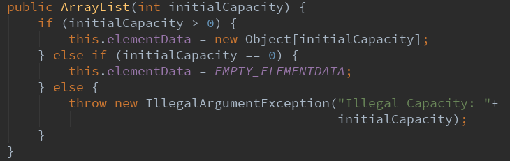
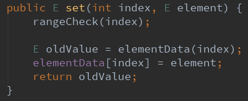
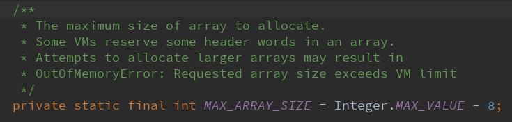
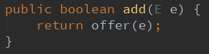
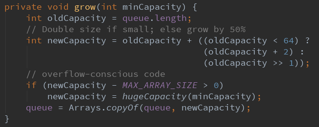
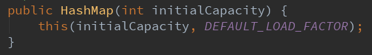
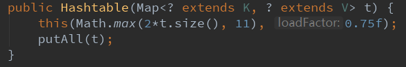

# 1. ArrayList


## 1.1 ArrayList的作用

ArrayList是实现List接口的动态数组，所谓动态就是它的大小是可变的。实现了所有可选列表操作，并**允许**包括 null 在内的所有元素。除了实现 List 接口外，此类还提供一些方法来操作内部用来存储列表的数组的大小。 

## 1.2 ArrayList如何进行同步

ArrayList是非线程安全的，如果要进行同步，可以使用下面的方法。

```
 List list = Collections.synchronizedList(new ArrayList(...)); 
```

## 1.3 构造函数

### 1.3.1 无参构造函数


注释是说构造一个容量大小为 10 的空的 list 集合，但构造函数了只是给 elementData 赋值了一个空的数组，**其实是在第一次添加元素时容量扩大至 10 的**。

### 1.3.2 有参构函数



### 1.3.3 指定Collection构造ArrayList


将 Collection 转化为数组并赋值给 elementData，把 elementData 中元素的个数赋值给 size。 如果 size 不为零，则判断 elementData 的 class 类型是否为 Object[]，不是的话则做一次转换。 如果 size 为零，则把 EMPTY_ELEMENTDATA 赋值给 elementData，相当于new ArrayList(0)。 

## 1.4 底层的数据结构


ArrayList底层的数组默认初始容量为10，构造ArrayList时可以给ArrayList指定一个初始容量，这样就会减少扩容时数据的拷贝问题。当然在添加大量元素前，应用程序也可以使用ensureCapacity操作来增加ArrayList实例的容量，这可以减少递增式再分配的数量。


底层是一个用transient（短暂）修饰的Object数组（为了序列化时减少不必要的空间），size为数组中元素真正的数量（即数组中最后一个真正有效的元素下标为**size - 1**）。

## 1.5 增

### 1.5.1 添加到队尾


先判断需不需要扩容，再赋值到最后面（不是数组的最后）

### 1.5.2 插入到中间


1. 先检查插入的位置是否合法（可以直接插到最后面），不合法就抛出异常。
2. 如果判断需不需要扩容。
3. 然后开始移动数组，将index位置开始的所有元素往后移一个位置，移动的元素个数为**size - index**。
4. 最后赋值，size + 1。

## 1.6 删

### 1.6.1 根据下标删除


1. 判断删除的位置是否合法，最大的删除位置下标为**size - 1**。
2. 然后删除位置后面的元素全部往左移动一个位置（注意移动不是真移动，而是从一个旧数组copy到啊一个新数组）。
3. 最后将最后一个元素置为null，等待垃圾回收。
4. 然后返回删除的值。

### 1.6.2 清空全部元素


将所有元素置为null，这样就可以让GC自动回收掉没有被引用的元素了。 

### 1.6.3 根据值删除


fastRemove和remove基本类似，没什么特别的。

## 1.7 改

### 1.7.1 根据下标进行修改



注意会返回旧值。

## 1.8 查


## 1.9 modCount


注意modCount是AbstractList的属性，ArrayList是它的子类，初始值为0。

作用：

在一个迭代器初始的时候会赋予它调用这个迭代器的对象的mCount，如何在迭代器遍历的过程中，一旦发现这个对象的mcount和迭代器中存储的mcount不一样那就抛异常 。

Fail-Fast 机制 
我们知道 java.util.ArrayList 不是线程安全的，ArrayList，那么将抛出ConcurrentModificationException，这就是所谓fail-fast策略。
这一策略在源码中的实现是通过 modCount 域，modCount 顾名思义就是修改次数，对ArrayList 内容的修改都将增加这个值，那么在迭代器初始化过程中会将这个值赋给迭代器的 expectedModCount。
在迭代过程中，判断 modCount 跟 expectedModCount 是否相等，如果不相等就表示已经有其他线程修改了 ArrayList。 

所以在这里和大家建议，当大家遍历那些非线程安全的数据结构时，尽量使用迭代器。

## 1.10 扩容方式

底层数组的初始值为10，扩容发生在add元素时。


两个空的数组有什么区别呢？ We distinguish this from EMPTY_ELEMENTDATA to know how much to inflate when first element is added. 简单来讲就是第一次添加元素时知道该 elementData 从空的构造函数还是有参构造函数被初始化的。以便确认如何扩容。 

然后if判断为true，则说明ArrayList是通过无参构造创建的。


如果数组还是初始数组，那么最小的扩容大小就是size+1和初始容量中较大的一个，初始容量为10。 因为addall方法也会调用该函数，所以此时需要做判断。 

然后判断扩容后的长度是否大于原来的数组，如果大于则说明原来的数组不够装了，需要扩容，开始调用grow()方法开始扩容。



数组的长度是有一个最大值的，如果数组长度没有限制，可以会出现堆区内容不足，或者超过JVM的最大限制。

数组作为一个对象，需要一定的内存存储对象头信息，对象头的信息最大占用内存不可超过8比特（1字节），数组的对象头信息比其他Object对象多了一个表示数组长度的信息。


默认将扩容至原来容量的 1.5 倍。但是扩容之后也不一定适用，有可能太小，有可能太大。所以才会有下面两个 if 判断。如果1.5倍太小的话，则将我们所需的容量大小赋值给newCapacity，如果1.5倍太大或者我们需要的容量太大，那就直接拿 newCapacity = (minCapacity > MAX_ARRAY_SIZE) ? Integer.MAX_VALUE : MAX_ARRAY_SIZE 来扩容。然后将原数组中的数据复制到大小为 newCapacity 的新数组中，并将新数组赋值给 elementData。 


当新容量大于最大数组长度，有两种情况，一种是溢出，抛异常，一种是没溢出，返回整数的最大值。 

### 1.10.1 为什么每次扩容都是1.5倍

通过google查找，发现1.5倍的扩容是最好的倍数。因为一次性扩容太大(例如2.5倍)可能会浪费更多的内存(1.5倍最多浪费33%，而2.5被最多会浪费60%，3.5倍则会浪费71%……)。但是一次性扩容太小，需要多次对数组重新分配内存，对性能消耗比较严重。所以1.5倍刚刚好，既能满足性能需求，也不会造成很大的内存消耗。

## 1.11 迭代器iterator

有使用过集合的都知道，在用 for 遍历集合的时候是不可以对集合进行 remove操作的，因为 remove 操作会改变集合的大小。从而容易造成结果不准确甚至数组下标越界，更严重者还会抛出 ConcurrentModificationException。 

foreach 遍历等同于 iterator 。

```
public Iterator<E> iterator() {
    return new Itr();
}
```

原来是直接返回一个 Itr 对象。

```
private class Itr implements Iterator<E> {
    int cursor;       // index of next element to return
    int lastRet = -1; // index of last element returned; -1 if no such
    int expectedModCount = modCount;

    public boolean hasNext() {
        return cursor != size;
    }

    @SuppressWarnings("unchecked")
    public E next() {
        checkForComodification();
        int i = cursor;
        if (i >= size)
            throw new NoSuchElementException();
        Object[] elementData = ArrayList.this.elementData;
        if (i >= elementData.length)
            throw new ConcurrentModificationException();
        cursor = i + 1;
        return (E) elementData[lastRet = i];
    }

    public void remove() {
        if (lastRet < 0)
            throw new IllegalStateException();
        checkForComodification();

        try {
            ArrayList.this.remove(lastRet);
            cursor = lastRet;
            lastRet = -1;
            expectedModCount = modCount;
        } catch (IndexOutOfBoundsException ex) {
            throw new ConcurrentModificationException();
        }
    }

    final void checkForComodification() {
        if (modCount != expectedModCount)
            throw new ConcurrentModificationException();
    }
}
```

从源码可以看出，ArrayList 定义了一个内部类 Itr 实现了 Iterator 接口。在 Itr 内部有三个成员变量。 cursor：代表下一个要访问的元素下标。 lastRet：代表上一个要访问的元素下标。 expectedModCount：代表对 ArrayList 修改次数的期望值，初始值为 modCount。

**下面看看 Itr 的三个主要函数。**

hasNext 实现比较简单，如果下一个元素的下标等于集合的大小 ，就证明到最后了。

next 方法也不复杂，但很关键。首先判断 `expectedModCount` 和 `modCount` 是否相等。然后对 `cursor` 进行判断，看是否超过集合大小和数组长度。然后将 `cursor` 赋值给 `lastRet` ，并返回下标为 lastRet 的元素。最后将 cursor 自增 1。开始时，`cursor = 0，lastRet = -1`；每调用一次 next 方法， cursor 和 lastRet 都会自增 1。

`remove` 方法首先会判断 `lastRet` 的值是否小于 0，然后在检查 `expectedModCount` 和 `modCount` 是否相等。接下来是**关键**，直接调用 ArrayList 的 `remove` 方法删除下标为 `lastRet` 的元素。然后将 `lastRet` 赋值给 cursor ，将 `lastRet` 重新赋值为 -1，并将 `modCount` **重新**赋值给 `expectedModCount`。 

https://blog.csdn.net/sihai12345/article/details/79382649

## 1.12 如何边遍历边remove

不可以调用ArrayList的remove方法，直接调用 iterator.remove() 即可。因为在该方法中增加了 expectedModCount = modCount 操作。但是这个 remove 方法也有弊端。

1、**只能**进行remove操作，add、clear 等 Itr 中没有。 
2、调用 remove 之前必须先调用 next。因为 remove 开始就对 lastRet 做了校验。而 lastRet 初始化时为 -1。 
3、next 之后只可以调用一次 remove。因为 remove 会将 lastRet 重新初始化为 -1

## 1.13 ArrayList的优缺点

ArrayList的**优点**如下：

1、ArrayList底层以数组实现，是一种随机访问模式，再加上它实现了RandomAccess接口，因此查找也就是get的时候非常快
2、ArrayList在顺序添加一个元素的时候非常方便，只是往数组里面添加了一个元素而已

不过ArrayList的**缺点**也十分明显：

1、删除元素的时候，涉及到一次元素复制，如果要复制的元素很多，那么就会比较耗费性能
2、插入元素的时候，涉及到一次元素复制，如果要复制的元素很多，那么就会比较耗费性能

因此，ArrayList比较适合顺序添加、随机访问的场景。

# 2. Vector(向量)


Vector可以实现可增长的对象数组。与数组一样，它包含可以使用整数索引进行访问的组件。不过，Vector的大小是可以增加或者减小的，以便适应创建Vector后进行添加或者删除操作。

Vector实现List接口，继承AbstractList类，所以我们可以将其看做队列，支持相关的添加、删除、修改、遍历等功能。

Vector实现RandmoAccess接口，即提供了随机访问功能，提供提供快速访问功能。在Vector我们可以直接访问元素。

Vector 实现了Cloneable接口，支持clone()方法，可以被克隆。

vector底层数组不加transient，序列化时会全部复制

## 2.1 构造方法

如果没有指定初始容量的话初始容量也是10。

### 2.1.1 无参构造


### 2.1.2 一个参数的构造


### 2.1.3 两个参数的构造


## 2.2 扩容方式


扩容方式与ArrayList基本一样，但是扩容时不是1.5倍扩容，而是有一个扩容增量。


 capacityIncrement：向量的大小大于其容量时，容量自动增加的量。

如果在创建Vector时，指定了capacityIncrement的大小；则，每次当Vector中动态数组容量增加时>，增加的大小都是capacityIncrement，如果增加一次不够，则和ArrayList一样直接使用刚刚好的值。

如果容量的增量小于等于零，则每次需要增大容量时，向量的容量将增大**一倍**。

## 2.3 线程安全

vector大部分方法都使用了synchronized修饰符，所以他是线层安全的集合类 

## 2.4 ArrayList和Vector的区别

Vector是ArrayList的**线程安全版本**，其实现90%和ArrayList都完全一样，区别在于：

1、Vector是线程安全的，ArrayList是线程非安全的
2、Vector可以指定增长因子，如果该增长因子指定了，那么扩容的时候会每次新的数组大小会在原数组的大小基础上加上增长因子；如果不指定增长因子，那么就给原数组大小*2。ArrayList扩容是1.5倍。
# 3. Stack


线程安全（因为是继承子Vector，本身自己的方法也有用synchronized修饰）

Stack通过五个操作对Vector进行扩展，允许将向量视为**堆栈**。这个五个操作如下：

1. empty()：测试堆栈是否为空。
2. peek()：查看堆栈顶部的对象，但不从堆栈中移除它。
3. pop()：移除堆栈顶部的对象，并作为此函数的值返回该对象。
4. push(E item)：把项压入堆栈顶部。
5. search(Object o)：返回对象在堆栈中的位置，以 1 为基数。 注意搜索是从后面开始找


# 4. LinkedList


**线程不安全**

LinkedList 是 Java 集合中比较常用的数据结构，与 ArrayList 一样，实现了 List 接口，只不过 ArrayList 是基于数组实现的，而 LinkedList 是基于链表**（双端链表，但是没有成环）**实现的。所以 LinkedList 插入和删除方面要优于 ArrayList，而随机访问上则 ArrayList 性能更好。  除了 LIst 接口之外，LinkedList 还实现了 Deque，Cloneable，Serializable 三个接口。这说明该数据结构支持**队列**，克隆和序列化操作的。

与 ArrayList 一样，允许 null 元素的存在，且是不支持多线程的。 

因为基于链表，所以插入删除极快，查找比较慢。 

实现了栈和队列的相关方法，所以可作为栈，队列，**双端**队列来用。 

## 4.1 属性


size为节点的个数，first指向头节点，头节点的prev属性指向null。

last指向尾节点，尾节点的next属性指向null。


Node为LinkedList的内部类

## 4.2 构造方法


LinkedList() 仅仅构造一个空的列表，没有任何元素。size = 0。first 和 last 都为 null。  后一个构造方法构造一个包含指定 Collection 中所有元素的列表，该构造方法首先会调用空的构造方法，然后通过 addAll() 的方式把 Collection 中的所有元素添加进去。 


checkPositionIndex()判断下标是否合法

```java
 public boolean addAll(int index, Collection<? extends E> c) {
        checkPositionIndex(index);

        Object[] a = c.toArray();
        int numNew = a.length;
        if (numNew == 0)
            return false;

        Node<E> pred, succ;
        // 如果index == size，说明是插到链表的尾部
        if (index == size) {
            succ = null;
            pred = last;
            // 如果index != size，说明是插入到index节点的前面
        } else {
            // 如果不是插入到尾部，找出原来下标的节点，如果index小于size值的一半，则从头节点往后找
            // 如果index大于size值的一半，则从尾节点往后找
            succ = node(index);
            pred = succ.prev;
        }
		
        // 一直往pred节点后面连接节点
        for (Object o : a) {
            @SuppressWarnings("unchecked") E e = (E) o;
            Node<E> newNode = new Node<>(pred, e, null);
            if (pred == null)
                first = newNode;
            else
                pred.next = newNode;
            pred = newNode;
        }
        
        // succ为null说明是插入到尾部，新的尾节点是最后一个插入的节点
        if (succ == null) {
            last = pred;
        } else {
            // 最后一个新节点的下一个节点为原来的index位置的节点
            pred.next = succ;
            // 原来index位置节点的前一个节点为最后一个插入的节点
            succ.prev = pred;
        }

        size += numNew;
     	// 操作次数加1，并不是加了多少个节点就加多少
        modCount++;
        return true;
    }
```


## 4.3 增

### 4.3.1 添加到链表尾部


### 4.3.2 添加到链表指定位置


### 4.3.3 另外还有直接插入到头部和尾部的方法

## 4.4 删

### 4.4.1 根据下标删除


被删除节点结束与前后节点的关联，等待GC。

### 4.4.2 根据内容删除


从头节点遍历到尾节点

### 4.4.3 另外还有删除头节点和尾节点的方法

## 4.5 查

查只能根据下标查


注意查找不是从头找到尾，而是先分两部分**（只分一次，为什么不直接使用二分查找直到找到？）**

## 4.6 改

只能根据下标改


## 4.7 迭代器

LInkedList 的 iterator() 方法是在其父类 AbstractSequentialList 中定义的 

```java
public ListIterator<E> listIterator(int index) {
        checkPositionIndex(index);
        return new ListItr(index);
    }

    private class ListItr implements ListIterator<E> {
        private Node<E> lastReturned;
        private Node<E> next;
        private int nextIndex;
        private int expectedModCount = modCount;

        ListItr(int index) {
            // assert isPositionIndex(index);
            next = (index == size) ? null : node(index);
            nextIndex = index;
        }

        public boolean hasNext() {
            return nextIndex < size;
        }

        public E next() {
            checkForComodification();
            if (!hasNext())
                throw new NoSuchElementException();

            lastReturned = next;
            next = next.next;
            nextIndex++;
            return lastReturned.item;
        }

        public boolean hasPrevious() {
            return nextIndex > 0;
        }

        public E previous() {
            checkForComodification();
            if (!hasPrevious())
                throw new NoSuchElementException();

            lastReturned = next = (next == null) ? last : next.prev;
            nextIndex--;
            return lastReturned.item;
        }

        public int nextIndex() {
            return nextIndex;
        }

        public int previousIndex() {
            return nextIndex - 1;
        }

        public void remove() {
            checkForComodification();
            if (lastReturned == null)
                throw new IllegalStateException();

            Node<E> lastNext = lastReturned.next;
            unlink(lastReturned);
            if (next == lastReturned)
                next = lastNext;
            else
                nextIndex--;
            lastReturned = null;
            expectedModCount++;
        }

        public void set(E e) {
            if (lastReturned == null)
                throw new IllegalStateException();
            checkForComodification();
            lastReturned.item = e;
        }

        public void add(E e) {
            checkForComodification();
            lastReturned = null;
            if (next == null)
                linkLast(e);
            else
                linkBefore(e, next);
            nextIndex++;
            expectedModCount++;
        }

        public void forEachRemaining(Consumer<? super E> action) {
            Objects.requireNonNull(action);
            while (modCount == expectedModCount && nextIndex < size) {
                action.accept(next.item);
                lastReturned = next;
                next = next.next;
                nextIndex++;
            }
            checkForComodification();
        }

        final void checkForComodification() {
            if (modCount != expectedModCount)
                throw new ConcurrentModificationException();
        }
    }
```

## 4.8 将LinkedList作为栈来使用

### 4.8.1 push()


插入到链表头

### 4.8.2 pop() 


删除头节点并返回头节点的值。

### 4.8.3 peek()


返回头节点

## 4.9 将LinkedList作为队列来使用

LinkedList可以实现双端队列和队列，这里只介绍队列

### 4.9.1 offer()


插到链表尾部

### 4.9.2 poll()

也是弹出头节点

### 4.9.3 peek()

也是弹出头节点

# 5. Queue

Queue接口定义了队列数据结构，元素是有序的(按插入顺序)，先进先出。 


DeQueue

> DeQueue(Double-ended queue)为接口，继承了Queue接口，创建双向队列，灵活性更强，可以前向或后向迭代，在**队头队尾**均可心插入或删除元素。它的两个主要实现类是**ArrayDeque和LinkedList**。LinkedList上文已经讲过了，底层用的是链表。
>
> 下面介绍一下ArrayDeque

## 5.1 ArrayDeque


**线程不安全**

底层使用循环数组实现双向队列，其实也可以当做是栈、队列来用。

### 5.1.1 属性


### 5.1.2 构造方法

#### 5.1.2.1 无参构造


默认数组的初始容量为**16**

#### 5.1.2.2 有参构造


如果自定义分配的容量大于等于8，扩大成2的幂（是为了维护头、尾下标值）；**否则使用最小容量8**

### 5.1.3 add扩容机制

```java
// add(E e) 调用 addLast(E e) 方法：
public void addLast(E e) {
   if (e == null)
      throw new NullPointerException("e == null");
   elements[tail] = e; // 根据尾索引，添加到尾端
   // 尾索引+1，并与数组（length - 1）进行取‘&’运算，因为length是2的幂，所以（length-1）转换为2进制全是1，
   // 所以如果尾索引值 tail 小于等于（length - 1），那么‘&’运算后仍为 tail 本身；如果刚好比（length - 1）大1时，
   // ‘&’运算后 tail 便为0（即回到了数组初始位置）。正是通过与（length - 1）进行取‘&’运算来实现数组的双向循环。
   // 如果尾索引+1和头索引重合了，说明数组满了，进行扩容。
   if ((tail = (tail + 1) & (elements.length - 1)) == head)
      doubleCapacity();// 扩容为原来的2倍
}


// addFirst(E e) 的实现：
public void addFirst(E e) {
   if (e == null)
      throw new NullPointerException("e == null");
   // 此处如果head为0，则-1（1111 1111 1111 1111 1111 1111 1111 1111）与（length - 1）进行取‘&’运算，结果必然是（length - 1），即回到了数组的尾部。
   elements[head = (head - 1) & (elements.length - 1)] = e;
   // 如果尾索引和头索引重合了，说明数组满了，进行扩容
   if (head == tail)
      doubleCapacity();
}
```

 

### 5.1.4 remove

弹出后并不是删除，而是修改head指针，让head指针指向下一个位置。

## 5.2 PriorityQueue


**线程不安全**

底层用**数组**实现堆的结构

优先队列跟普通的队列不一样，普通队列是一种遵循FIFO规则的队列，拿数据的时候按照加入队列的顺序拿取。 而优先队列每次拿数据的时候都会拿出优先级最高的数据。

优先队列内部维护着一个堆，每次取数据的时候都从堆顶拿数据（堆顶的优先级最高），这就是优先队列的原理。

**默认是小顶堆**

1、jdk内置的优先队列PriorityQueue内部使用一个堆维护数据，每当有数据add进来或者poll出去的时候会对堆做从下往上的调整和从上往下的调整。

2、PriorityQueue**不是线程安全**的类，如果要在多线程环境下使用，可以使用**PriorityBlockingQueue 这个优先阻塞队列**。其中add、poll、remove方法都使用 ReentrantLock 锁来保持同步，take() 方法中如果元素为空，则会一直保持阻塞。

### 5.2.1 add




**默认数组大小为11**




# 6. HashMap

**线程不安全**

以下的源码参考的是JDK8的实现

HashMap也是我们使用非常多的Collection，它是基于哈希表的 Map 接口的实现，以key-value的形式存在。在HashMap中，key-value总是会当做一个整体来处理，系统会根据hash算法来来计算key-value的存储位置，我们总是可以通过key快速地存、取value。

HashMap实现了Map接口，继承AbstractMap。其中Map接口定义了键映射到值的规则，而AbstractMap类提供 Map 接口的骨干实现，以最大限度地减少实现此接口所需的工作 。


HashMap**最多**只允许一个key为null的键值对，但允许多个值为null的键值对。LinkedHashMap也一样拥有这特性。

## 6.1 属性

```java
	// 初始容量为16(2^4)
    static final int DEFAULT_INITIAL_CAPACITY = 1 << 4; // aka 16
	
	// 最大容量为2^30
    static final int MAXIMUM_CAPACITY = 1 << 30;
	
    // 负载因子
    static final float DEFAULT_LOAD_FACTOR = 0.75f;
	
    // 如果加上新节点后桶里面的节点树大于8，则链表转为红黑树
    static final int TREEIFY_THRESHOLD = 8;

    static final int UNTREEIFY_THRESHOLD = 6;

    static final int MIN_TREEIFY_CAPACITY = 64;
    
    // HashMap的底层数组
    transient Node<K,V>[] table;

    transient Set<Map.Entry<K,V>> entrySet;
    
    // 所有桶里面节点的数量，当该值大于阀值时，就会进行扩容。
    transient int size;
    
    transient int modCount;
	
    // HashMap的极限容量(阀值)，当HashMap的容量达到该极限时间会进行扩容
    int threshold;
	
	// 负载因子
    final float loadFactor;
```

**容量表示哈希表中桶的数量，初始容量是创建哈希表时的容量**，加载因子是哈希表在其容量自动增加之前可以达到多满的一种尺度，它衡量的是一个散列表的空间的使用程度，负载因子越大表示散列表的装填程度越高，反之愈小。

对于使用链表法的散列表来说，查找一个元素的平均时间是O(1+a)，因此如果负载因子越大，对空间的利用更充分，然而后果是查找效率的降低；如果负载因子太小，那么散列表的数据将过于稀疏，对空间造成严重浪费。系统默认负载因子为0.75，一般情况下我们是无需修改的。


以下为HashMap的静态内部节点类

```java
static class Node<K,V> implements Map.Entry<K,V> {
        final int hash;
        final K key;
        V value;
        Node<K,V> next;

        Node(int hash, K key, V value, Node<K,V> next) {
            this.hash = hash;
            this.key = key;
            this.value = value;
            this.next = next;
        }

        public final K getKey()        { return key; }
        public final V getValue()      { return value; }
        public final String toString() { return key + "=" + value; }

        public final int hashCode() {
            return Objects.hashCode(key) ^ Objects.hashCode(value);
        }

        public final V setValue(V newValue) {
            V oldValue = value;
            value = newValue;
            return oldValue;
        }

        public final boolean equals(Object o) {
            // 如果堆地址一样，直接返回true，不一样才执行下面，比较key和value
            if (o == this)
                return true;
            // 为什么这里要用instanceof判断？
            if (o instanceof Map.Entry) {
                Map.Entry<?,?> e = (Map.Entry<?,?>)o;
                // 根据key和value判断是否相同
                if (Objects.equals(key, e.getKey()) &&
                    Objects.equals(value, e.getValue()))
                    return true;
            }
            return false;
        }
    }
```

## 6.2 构造方法

### 6.2.1 无参构造


指定负载因子为默认值0.75f，loadFactor是用final修饰的float型变量，一旦被赋值后就不可以修改了。

### 6.2.2 一个参数的构造方法



指定一个初始容量，然后使用默认的负载因子调用下面的构造方法。


如果初始容量大于最大允许的容量，则将容量设为最大允许的容量**2^30**

判断负载因子是否小于等于0或者等于0.0，如果是则抛出异常。

然后计算出大于或者等于initialCapacity 的最小的 2 的 n 次方值，赋值给HashMap的**阀值**。

```java
 /**
     * Returns a power of two size for the given target capacity.
     */
    static final int tableSizeFor(int cap) {
        // cap为用户指定的初始容量，即哈希表的桶数量
        int n = cap - 1;
        // >>>为无符号右移
        n |= n >>> 1;
        n |= n >>> 2;
        n |= n >>> 4;
        n |= n >>> 8;
        n |= n >>> 16;
        return (n < 0) ? 1 : (n >= MAXIMUM_CAPACITY) ? MAXIMUM_CAPACITY : n + 1;
    }
```


isNaN是Float包装类自带的方法。

NaN 实际上就是 Not a Number的简称。0.0f/0.0f的值就是NaN，从数学角度说，0/0就是一种未确定。

0.0f / 0.0f != 0.0f / 0.0f 

0.0f / 0.0f返回的是NaN 

 两个NaN永远不相等

### 6.2.3 两个参数的构造方法

### 6.2.4 添加一个Map的构造方法


下面的方法用于初始化数组或者数组扩容，每次扩容后，容量变为原来的2倍，并进行数据迁移。

```java
 final Node<K,V>[] resize() {
     	// table为保存Node节点的数组
        Node<K,V>[] oldTab = table;
        // 旧数组的大小（容量）,如果旧数组还没初始化，则将旧数组的容量设为1
        int oldCap = (oldTab == null) ? 0 : oldTab.length;
     	// 原来Map的阀值
        int oldThr = threshold;
        // 新的容量和阀值
        int newCap, newThr = 0;
     
        // 如果原来的数组已经初始化
        if (oldCap > 0) {
            // 如果原来的容量已经大于等于允许的最大容量
            if (oldCap >= MAXIMUM_CAPACITY) {
                // 将阀值设为Integer的最大值
                threshold = Integer.MAX_VALUE;
                // 返回原来的数组
                return oldTab;
            }
            // 如果旧容量的两倍小于最大允许的容量，并且旧容量大于等于16
            else if ((newCap = oldCap << 1) < MAXIMUM_CAPACITY &&
                     oldCap >= DEFAULT_INITIAL_CAPACITY)
                // 则将新极限值设为旧极限值的两倍
                newThr = oldThr << 1; // double threshold
        }
     
        // 如果数组还未初始化，只设置了阀值（阀值由给定的容量得到），则将新容量设为旧的极限值
        else if (oldThr > 0) // initial capacity was placed in threshold
            newCap = oldThr;
     
        // 如果数组还未初始化，也还没设置阀值（即只调用了无参构造设置了负载因子）
        else {               // zero initial threshold signifies using defaults
            // 将容量设为16
            newCap = DEFAULT_INITIAL_CAPACITY;
            // 将阀值设为16*0.75 = 12
            newThr = (int)(DEFAULT_LOAD_FACTOR * DEFAULT_INITIAL_CAPACITY);
        }
     
        // 如果阀值为0？
        if (newThr == 0) {
            // 新容量乘以负载因子
            float ft = (float)newCap * loadFactor;
            newThr = (newCap < MAXIMUM_CAPACITY && ft < (float)MAXIMUM_CAPACITY ?
                      (int)ft : Integer.MAX_VALUE);
        }
        // 设置HashMap新的阀值
        threshold = newThr;
        // 新建一个新数组
        @SuppressWarnings({"rawtypes","unchecked"})
            Node<K,V>[] newTab = (Node<K,V>[])new Node[newCap];
        // 替换原来的数组，新数组作为Map的底层数组
        table = newTab;
        if (oldTab != null) {
            for (int j = 0; j < oldCap; ++j) {
                Node<K,V> e;
                if ((e = oldTab[j]) != null) {
                    // 设为null，等待GC
                    oldTab[j] = null;
                    // 桶里只有一个元素
                    if (e.next == null)
                        newTab[e.hash & (newCap - 1)] = e;
                    // 如果是红黑树，这里不展开
                    else if (e instanceof TreeNode)
                        ((TreeNode<K,V>)e).split(this, newTab, j, oldCap);
                    // 桶里有多个元素
                    else { // preserve order
                        // 将原来的链表拆成两个链表，放到新的数组中，并且保持原来的先后顺序
                        Node<K,V> loHead = null, loTail = null;
                        Node<K,V> hiHead = null, hiTail = null;
                        Node<K,V> next;
                        do {
                            next = e.next;
                            if ((e.hash & oldCap) == 0) {
                                if (loTail == null)
                                    loHead = e;
                                else
                                    loTail.next = e;
                                loTail = e;
                            }
                            else {
                                if (hiTail == null)
                                    hiHead = e;
                                else
                                    hiTail.next = e;
                                hiTail = e;
                            }
                        } while ((e = next) != null);
                        if (loTail != null) {
                            loTail.next = null;
                            newTab[j] = loHead;
                        }
                        if (hiTail != null) {
                            hiTail.next = null;
                            // 新的大小扩大了两倍
                            newTab[j + oldCap] = hiHead;
                        }
                    }
                }
            }
        }
        return newTab;
    }
```

## 6.3 put


注意如果key为**null**返回的结果是**0**

```java
/**
     * Implements Map.put and related methods
     *
     * @param hash hash for key
     * @param key the key
     * @param value the value to put
     * @param onlyIfAbsent if true, don't change existing value
     * @param evict if false, the table is in creation mode.
     * @return previous value, or null if none
     */
    // 第三个参数 onlyIfAbsent 如果是 true，那么只有在不存在该 key 时才会进行 put 操作。
    // 第四个参数 evict是LinkedHashMap的排序顺序（true为按访问顺序排序，false为按插入顺序排序）
    final V putVal(int hash, K key, V value, boolean onlyIfAbsent,
                   boolean evict) {
        Node<K,V>[] tab; 
        Node<K,V> p; 
        int n, i;
        // 如果数组还没初始化则进行初始化
        if ((tab = table) == null || (n = tab.length) == 0)
            // n为容量大小
            n = (tab = resize()).length;
        // 如果key的hash值取模后的桶里面还没有元素，则直接设置
        if ((p = tab[i = (n - 1) & hash]) == null)
            tab[i] = newNode(hash, key, value, null);
        // 桶里已存在元素
        else {
            Node<K,V> e; K k;
            // 首先，判断该位置的第一个数据和我们要插入的数据，key 是不是"相等"，如果是，取出这个节点
            if (p.hash == hash &&
                ((k = p.key) == key || (key != null && key.equals(k))))
                e = p;
            // 如果该节点是代表红黑树的节点，调用红黑树的插值方法，本文不展开说红黑树
            else if (p instanceof TreeNode)
                e = ((TreeNode<K,V>)p).putTreeVal(this, tab, hash, key, value);
            else {
                for (int binCount = 0; ; ++binCount) {
                    if ((e = p.next) == null) {
                        p.next = newNode(hash, key, value, null);
                        // TREEIFY_THRESHOLD 为 8，所以，如果新插入的值是链表中的第 9 个
                        // 会触发下面的 treeifyBin，也就是将链表转换为红黑树
                        if (binCount >= TREEIFY_THRESHOLD - 1) // -1 for 1st
                            treeifyBin(tab, hash);
                        break;
                    }
                     // 如果在该链表中找到了"相等"的 key(== 或 equals)，则跳出循环
                    if (e.hash == hash &&
                        ((k = e.key) == key || (key != null && key.equals(k))))
                        break;
                    p = e;
                }
            }
            if (e != null) { // existing mapping for key
                V oldValue = e.value;
                // onlyIfAbsent在put方法中为false，表示存在key也可以进行put操作，覆盖原来key的value
                // 这就解释了HashMap中没有两个相同的key
                if (!onlyIfAbsent || oldValue == null)
                    e.value = value;
                // 在HashMap中方法体为空，没有意义，LinkedHashMap为覆载这个方法
                afterNodeAccess(e);
                return oldValue;
            }
        }
        ++modCount;
        // 元素个数超出阀值，进行扩容
        if (++size > threshold)
            resize();
        // 在HashMap中方法体为空，没有意义，LinkedHashMap为覆载这个方法
        afterNodeInsertion(evict);
        return null;
    }
```

## 6.4 get


```java
/**
     * Implements Map.get and related methods
     *
     * @param hash hash for key
     * @param key the key
     * @return the node, or null if none
     */
    final Node<K,V> getNode(int hash, Object key) {
        Node<K,V>[] tab; Node<K,V> first, e; int n; K k;
        // 数组存在元素且hash值取模后得到的节点不为null才继续找，不然返回null
        if ((tab = table) != null && (n = tab.length) > 0 &&
            (first = tab[(n - 1) & hash]) != null) {
            
            if (first.hash == hash && // always check first node
                ((k = first.key) == key || (key != null && key.equals(k))))
                return first;
            // 如果同步里面元素不止一个，则循环找到key符合的
            if ((e = first.next) != null) {
                if (first instanceof TreeNode)
                    return ((TreeNode<K,V>)first).getTreeNode(hash, key);
                do {
                    if (e.hash == hash &&
                        ((k = e.key) == key || (key != null && key.equals(k))))
                        return e;
                } while ((e = e.next) != null);
            }
            
        }
        return null;
    }
```

## 6.5 计算数组下标位置

tab[(n - 1) & hash，n为数组的长度

我们知道对于HashMap的table而言，数据分布需要均匀（最好每项都只有一个元素，这样就可以直接找到），不能太紧也不能太松，太紧会导致查询速度慢，太松则浪费空间。计算hash值后，怎么才能保证table元素分布均与呢？我们会想到取模 。

HashMap的底层数组长度总是2的n次方，当length为2的n次方时，h&(length - 1)就相当于对length取模，而且速度比直接取模快得多，这是HashMap在速度上的一个优化。

对length取模来得到hash是常用的hash索引方法，这里采用位运算的话效率更高。 

为什么是2^n?

当length = 16时，length – 1 = 15 即1111，那么进行低位&运算时，值总是与原来hash值相同，而进行高位运算时，其值等于其低位值。所以说当length = 2^n时，不同的hash值发生碰撞的概率比较小，这样就会使得数据在table数组中分布较均匀，查询速度也较快。**(也就是只取低位，不取高位)**

# 7. Hashtable

以下代码为JDK8的实现


HashTable继承Dictionary类，实现Map接口。其中Dictionary类是任何可将键映射到相应值的类（如 Hashtable）的抽象父类。每个键和每个值都是一个对象。在任何一个 Dictionary 对象中，每个键至多与一个值相关联。Map是"key-value键值对"接口。

**Hashtable键值对的key和value都不能为null，不然会报错，在JDK8的实现中Hashtable在put方法中只对value做了是否为null的判断，key为null会直接报错。**

## 7.1 属性

```java
    // 为一个Entry[]数组类型，Entry代表了“拉链”的节点，每一个Entry代表了一个键值对，哈希表的"key-value键值对"都是存储在Entry数组中的。
    private transient Entry<?,?>[] table;
	
    // HashTable的大小，注意这个大小并不是HashTable的容器大小，而是他所包含Entry键值对的数量。
    private transient int count;
	
    // 阀值，等于容量*负载因子
    private int threshold;
    
    // 负载因子
    private float loadFactor;
    
    /* 用来实现“fail-fast”机制的（也就是快速失败）。所谓快速失败就是在并发集合中，其进行迭代操作时，若有其他线程对其进行结构性的修改，这时迭代器会立马感知到，并且立即抛出ConcurrentModificationException异常，而不是等到迭代完成之后才告诉你（你已经出错了）。*/
    private transient int modCount = 0;
```

Entry内部类

```java
/**
     * Hashtable bucket collision list entry
     */
    private static class Entry<K,V> implements Map.Entry<K,V> {
        final int hash;
        final K key;
        V value;
        Entry<K,V> next;

        protected Entry(int hash, K key, V value, Entry<K,V> next) {
            this.hash = hash;
            this.key =  key;
            this.value = value;
            this.next = next;
        }

        @SuppressWarnings("unchecked")
        protected Object clone() {
            return new Entry<>(hash, key, value,
                                  (next==null ? null : (Entry<K,V>) next.clone()));
        }

        // Map.Entry Ops

        public K getKey() {
            return key;
        }

        public V getValue() {
            return value;
        }

        public V setValue(V value) {
            if (value == null)
                throw new NullPointerException();

            V oldValue = this.value;
            this.value = value;
            return oldValue;
        }

        public boolean equals(Object o) {
            if (!(o instanceof Map.Entry))
                return false;
            Map.Entry<?,?> e = (Map.Entry<?,?>)o;

            return (key==null ? e.getKey()==null : key.equals(e.getKey())) &&
               (value==null ? e.getValue()==null : value.equals(e.getValue()));
        }

        public int hashCode() {
            return hash ^ Objects.hashCode(value);
        }

        public String toString() {
            return key.toString()+"="+value.toString();
        }
    }
```

## 7.2 构造方法

### 7.2.1 无参构造


在构造方法就初始化数组（JDK8的HashMap不是这样），**容量默认为11**，负载因子为0.75。

阀值为容量*负载因子和最大数组大小中较小的一个。

### 7.2.2 一个参数的构造方法


指定数组的初始容量，如果容量为0，则后面的构造方法会将容量设为1。

### 7.2.3 两个参数的构造方法

不是什么构造方法，最后都会调用到这个两个参数的构造方法。

### 7.2.4 一个Map集合的构造方法



如果Map的键值对数的2倍小于11，则将初始容量设为11，如果否则将初始容量设为Map键值对数的两倍。


```java
public synchronized V put(K key, V value) {
        // Hashtable的value不能null
        if (value == null) {
            throw new NullPointerException();
        }

        // Makes sure the key is not already in the hashtable.
        Entry<?,?> tab[] = table;
        // int占4个字节，32位
        int hash = key.hashCode();
        // 0x7FFFFFFF对应的二进制为 ‭01111111111111111111111111111111‬（2^31 - 1）
        // 确定key的索引位置
        int index = (hash & 0x7FFFFFFF) % tab.length;
        @SuppressWarnings("unchecked")
        Entry<K,V> entry = (Entry<K,V>)tab[index];
        for(; entry != null ; entry = entry.next) {
            // 如果key已经存在了，就替换掉原来的value，因此Hashtable和HashMap一样里面没有重复的key
            if ((entry.hash == hash) && entry.key.equals(key)) {
                V old = entry.value;
                entry.value = value;
                return old;
            }
        }
	   // 如果key不存在，则添加Entry
        addEntry(hash, key, value, index);
        return null;
    }
```

```java
private void addEntry(int hash, K key, V value, int index) {
        modCount++;

        Entry<?,?> tab[] = table;
        // 如果节点数大于等于阀值，则进行扩容
        if (count >= threshold) {
            // Rehash the table if the threshold is exceeded
            rehash();
      	    // 扩容后指向新的数组
            tab = table;
            hash = key.hashCode();
            // 重新计算下标
            index = (hash & 0x7FFFFFFF) % tab.length;
        }
	    // 将节点插入链表头而不是插入链表尾
        // Creates the new entry.
        @SuppressWarnings("unchecked")
        Entry<K,V> e = (Entry<K,V>) tab[index];
        tab[index] = new Entry<>(hash, key, value, e);
        // 节点数加1
        count++;
    }
```

```java
 /**
     * Increases the capacity of and internally reorganizes this
     * hashtable, in order to accommodate and access its entries more
     * efficiently.  This method is called automatically when the
     * number of keys in the hashtable exceeds this hashtable's capacity
     * and load factor.
     */
    @SuppressWarnings("unchecked")
    protected void rehash() {
        int oldCapacity = table.length;
        Entry<?,?>[] oldMap = table;

        // overflow-conscious code
        int newCapacity = (oldCapacity << 1) + 1;
        if (newCapacity - MAX_ARRAY_SIZE > 0) {
            // 如果原来数组大小已经达到最大数组长度，则不进行扩容
            if (oldCapacity == MAX_ARRAY_SIZE)
                // Keep running with MAX_ARRAY_SIZE buckets
                return;
            // 如果新数组容量大于最大数组长度，则将新容量变为最大数组长度
            newCapacity = MAX_ARRAY_SIZE;
        }
        // 新建一个新数组
        Entry<?,?>[] newMap = new Entry<?,?>[newCapacity];

        modCount++;
        // 新的阀值
        threshold = (int)Math.min(newCapacity * loadFactor, MAX_ARRAY_SIZE + 1);
        table = newMap;

        // 将旧数组的内容放到新数组里
        for (int i = oldCapacity ; i-- > 0 ;) {
            for (Entry<K,V> old = (Entry<K,V>)oldMap[i] ; old != null ; ) {
                Entry<K,V> e = old;
                old = old.next;

                int index = (e.hash & 0x7FFFFFFF) % newCapacity;
                e.next = (Entry<K,V>)newMap[index];
                newMap[index] = e;
            }
        }
    }
```

## 7.3 put

## 7.4 get


找到对应的下标，然后迭代链表

## 7.5 HashMap和Hashtable的区别

1. HashMap的默认初始容量为16,Hashtable的默认初始容量为11。
2. 在JDK8的实现中，HashMap的底层数组没有在构造方法初始化，而是在第一次put的时候初始化，而Hashtable的底层数组在构造方法就初始化好了（不管哪个构造方法最后都会调用两个参数的构造方法）。
3. 他们的定义就可以看出他们的不同，HashTable基于Dictionary类，而HashMap是基于AbstractMap。Dictionary是什么？它是任何可将键映射到相应值的类的抽象父类，而AbstractMap是基于Map接口的骨干实现，它以最大限度地减少实现此接口所需的工作。
4. HashMap可以允许存在一个为null的key和任意个为null的value，但是HashTable中的key和value都不允许为null。 
5. **Hashtable的方法是同步的**，而HashMap的方法不是。所以有人一般都建议如果是涉及到多线程同步时采用HashTable，没有涉及就采用HashMap，但是在Collections类中存在一个静态方法：synchronizedMap()，该方法创建了一个线程安全的Map对象，并把它作为一个封装的对象来返回，所以通过Collections类的synchronizedMap方法是可以我们你同步访问潜在的HashMap。这样君该如何选择呢？？？

# 8. LinkedHashMap

下面LinkedHashMap的源码是基与JDK1.8的。


注意它是HashMap的子类

HashMap和**双向链表**合二为一即是LinkedHashMap。所谓LinkedHashMap，其落脚点在HashMap，因此更准确地说，它是一个将所有Entry节点链入一个双向链表的HashMap。 

由于LinkedHashMap是HashMap的子类，所以LinkedHashMap自然会拥有HashMap的所有特性。比如，LinkedHashMap的元素存取过程基本与HashMap基本类似，只是在细节实现上稍有不同。当然，这是由LinkedHashMap本身的特性所决定的，因为它额外维护了一个双向链表用于保持迭代顺序，**以决定迭代时输出的顺序**。 

LinkedHashMap可以很好的支持LRU算法 。

**方法不是同步的，即不是线程安全的。**

## 8.1 为什么要使用LinkedHashMap?

**HashMap是无序的**，也就是说，迭代HashMap所得到的元素顺序并不是它们最初放置到HashMap的顺序。 

HashMap的这一缺点往往会造成诸多不便，因为在有些场景中，我们确需要用到一个可以保持插入顺序的Map。庆幸的是，JDK为我们解决了这个问题，它为HashMap提供了一个子类 —— LinkedHashMap。虽然**LinkedHashMap增加了时间和空间上的开销，但是它通过维护一个额外的双向链表保证了迭代顺序**。

特别地，该迭代顺序可以是插入顺序，也可以是访问顺序。因此，根据链表中元素的顺序可以将LinkedHashMap分为：保持插入顺序的LinkedHashMap和保持访问顺序的LinkedHashMap，其中**LinkedHashMap的默认实现是按插入顺序排序的**。 

## 8.2 属性


LinkedHashMap中的Entry内部类继承了HashMap的节点类，增加了两个指针，用于指向前一个节点和后一个节点。

```java
    // 内部类
    static class Entry<K,V> extends HashMap.Node<K,V> {
        Entry<K,V> before, after;
        Entry(int hash, K key, V value, Node<K,V> next) {
            super(hash, key, value, next);
        }
    }

    private static final long serialVersionUID = 3801124242820219131L;

    // 头节点
    transient LinkedHashMap.Entry<K,V> head;

    // 尾节点
    transient LinkedHashMap.Entry<K,V> tail;

    /**
     * true就按访问顺序排序
     * false就按插入顺序排序
     */
    final boolean accessOrder;
```

## 8.3 构造方法

### 8.3.1 LinkedHashMap()


默认访问顺序为按插入顺序排序

### 8.3.2 LinkedHashMap(int)


### 8.3.3  LinkedHashMap(int, float)


### 8.3.4 LinkedHashMap(int, float, boolean)


accessOrder为指定排序方式。

### 8.3.5 LinkedHashMap(Map)


putMapEntries()是HashMap的方法。


如果插入的时候key已经存在在HashMap，则会调用afterNodeAccess()方法（在HashMap中该方法没有什么作用），该方法主要是用于通过**访问顺序**进行排序。

```java
void afterNodeAccess(Node<K,V> e) { // move node to last
        LinkedHashMap.Entry<K,V> last;
        // 如果是按访问顺序排序且当前节点不是尾节点
        if (accessOrder && (last = tail) != e) {
            LinkedHashMap.Entry<K,V> p =
                (LinkedHashMap.Entry<K,V>)e, b = p.before, a = p.after;
            p.after = null;
            // b为原来节点的后一个节点
            if (b == null)
                head = a;
            else
                b.after = a;
            // a为原来节点的前一个节点
            if (a != null)
                a.before = b;
            else
                last = b;
            // 如果原来的尾节点为null
            if (last == null)
                // 将头节点设为当前
                head = p;
            else {
                p.before = last;
                last.after = p;
            }
            // 当前节点作为尾节点
            tail = p;
            ++modCount;
        }
}
```


LinkedHashMap不会执行下面的方法。它们是构建LruCache需要的回调，在`LinkedHashMap`里可以忽略它们，如果需要实现LRU算法，需要创建一个类继承LinkedHashMap，将accessOrder设为true，然后重写removeEldestEnttry（）方法，自己设定逻辑，比如size大于6时间返回true，removeNode()方法会删除掉头节点（因为新节点都是插入到链表的尾部，头部是很久没用的节点了）。

```java
void afterNodeInsertion(boolean evict) { // possibly remove eldest
        LinkedHashMap.Entry<K,V> first;
        if (evict && (first = head) != null && removeEldestEntry(first)) {
            K key = first.key;
            removeNode(hash(key), key, null, false, true);
        }
 }
```

```java
protected boolean removeEldestEntry(Map.Entry<K,V> eldest) {
    return false;
}
```

## 8.4 get


## 8.5 newNode()

LinkedHashMap并没有重写任何put方法。但是其重写了构建新节点的newNode()方法. 
newNode()会在HashMap的putVal()方法里被调用，putVal()方法会在批量插入数据putMapEntries(Map<? extends K, ? extends V> m, boolean evict)或者插入单个数据public V put(K key, V value)时被调用。

LinkedHashMap重写了newNode(),在每次构建新节点时，通过linkNodeLast(p);将新节点链接在内部双向链表的尾部。


```Java
  // link at the end of list
    private void linkNodeLast(LinkedHashMap.Entry<K,V> p) {
        LinkedHashMap.Entry<K,V> last = tail;
        tail = p;
        if (last == null)
            head = p;
        else {
            p.before = last;
            last.after = p;
        }
    }
```

## 8.6 总结

LinkedHashMap相对于HashMap的源码比，是很简单的。因为大树底下好乘凉。它继承了HashMap，仅重写了几个方法，以改变它迭代遍历时的顺序。这也是其与HashMap相比最大的不同。 

在每次插入数据，或者访问、修改数据时，会增加节点、或调整链表的节点顺序。以决定迭代时输出的顺序。

accessOrder ,默认是false，则迭代时输出的顺序是插入节点的顺序。若为true，则输出的顺序是按照访问节点的顺序。为true时，可以在这基础之上构建一个LruCache。

LinkedHashMap并没有重写任何put方法。但是其重写了构建新节点的newNode()方法.在每次构建新节点时，将新节点链接在内部双向链表的尾部。

accessOrder=true的模式下,在afterNodeAccess()函数中，会将当前被访问到的节点e，移动至内部的双向链表的尾部。值得注意的是，afterNodeAccess()函数中，会修改modCount,**因此当你正在accessOrder=true的模式下,迭代LinkedHashMap时，如果同时查询访问数据，也会导致fail-fast，因为迭代的顺序已经改变**。

nextNode() 就是迭代器里的next()方法 。 
该方法的实现可以看出，迭代LinkedHashMap，就是从内部维护的双链表的表头开始循环输出。 而双链表节点的顺序在LinkedHashMap的增、删、改、查时都会更新。以满足按照插入顺序输出，或者访问顺序输出。

# 9. ConcurrentHashMap

\

ConcurentMap是继承Map接口的接口，AbstractMap是实现Map接口的抽象类。

整个 ConcurrentHashMap 由一个个 Segment 组成，Segment 代表”部分“或”一段“的意思，所以很多地方都会将其描述为分段锁。注意，行文中，我很多地方用了“槽”来代表一个 segment。

简单理解就是，ConcurrentHashMap 是一个 Segment 数组，Segment 通过继承 ReentrantLock 来进行加锁，所以每次需要加锁的操作锁住的是一个 segment，这样只要保证每个 Segment 是线程安全的，也就实现了全局的线程安全。

## 9.1 属性

```java
 /* ---------------- Constants -------------- */

    // 最大容量为2^30
    private static final int MAXIMUM_CAPACITY = 1 << 30;

    // 默认容量为16，和HashMap一样
    private static final int DEFAULT_CAPACITY = 16;
    
    static final int MAX_ARRAY_SIZE = Integer.MAX_VALUE - 8;

    // 最大并发数，即ConcurrentHashMap的最大段数，不可扩容
    private static final int DEFAULT_CONCURRENCY_LEVEL = 16;

    private static final float LOAD_FACTOR = 0.75f;

    // 红黑树阀值，但是和HashMap、LinkedHashMap不一样的是，不一定节点数超过8就进行转换。
    static final int TREEIFY_THRESHOLD = 8;

    /**
     * The bin count threshold for untreeifying a (split) bin during a
     * resize operation. Should be less than TREEIFY_THRESHOLD, and at
     * most 6 to mesh with shrinkage detection under removal.
     */
    static final int UNTREEIFY_THRESHOLD = 6;

    /**
     * The smallest table capacity for which bins may be treeified.
     * (Otherwise the table is resized if too many nodes in a bin.)
     * The value should be at least 4 * TREEIFY_THRESHOLD to avoid
     * conflicts between resizing and treeification thresholds.
     */
    static final int MIN_TREEIFY_CAPACITY = 64;

    /**
     * Minimum number of rebinnings per transfer step. Ranges are
     * subdivided to allow multiple resizer threads.  This value
     * serves as a lower bound to avoid resizers encountering
     * excessive memory contention.  The value should be at least
     * DEFAULT_CAPACITY.
     */
    private static final int MIN_TRANSFER_STRIDE = 16;

    /**
     * The number of bits used for generation stamp in sizeCtl.
     * Must be at least 6 for 32bit arrays.
     */
    private static int RESIZE_STAMP_BITS = 16;

    /**
     * The maximum number of threads that can help resize.
     * Must fit in 32 - RESIZE_STAMP_BITS bits.
     */
    private static final int MAX_RESIZERS = (1 << (32 - RESIZE_STAMP_BITS)) - 1;

    /**
     * The bit shift for recording size stamp in sizeCtl.
     */
    private static final int RESIZE_STAMP_SHIFT = 32 - RESIZE_STAMP_BITS;

    /*
     * Encodings for Node hash fields. See above for explanation.
     */
    static final int MOVED     = -1; // hash for forwarding nodes
    static final int TREEBIN   = -2; // hash for roots of trees
    static final int RESERVED  = -3; // hash for transient reservations
    static final int HASH_BITS = 0x7fffffff; // usable bits of normal node hash

    /** Number of CPUS, to place bounds on some sizings */
    // 获取CPU的数量，以限制某些大小
    static final int NCPU = Runtime.getRuntime().availableProcessors();

    /** For serialization compatibility. */
    private static final ObjectStreamField[] serialPersistentFields = {
        new ObjectStreamField("segments", Segment[].class),
        new ObjectStreamField("segmentMask", Integer.TYPE),
        new ObjectStreamField("segmentShift", Integer.TYPE)
    };
```

内部类

```java
 static class Node<K,V> implements Map.Entry<K,V> {
        final int hash;
        final K key;
        volatile V val;
        volatile Node<K,V> next;

        Node(int hash, K key, V val, Node<K,V> next) {
            this.hash = hash;
            this.key = key;
            this.val = val;
            this.next = next;
        }

        public final K getKey()       { return key; }
        public final V getValue()     { return val; }
        public final int hashCode()   { return key.hashCode() ^ val.hashCode(); }
        public final String toString(){ return key + "=" + val; }
        public final V setValue(V value) {
            throw new UnsupportedOperationException();
        }

        public final boolean equals(Object o) {
            Object k, v, u; Map.Entry<?,?> e;
            return ((o instanceof Map.Entry) &&
                    (k = (e = (Map.Entry<?,?>)o).getKey()) != null &&
                    (v = e.getValue()) != null &&
                    (k == key || k.equals(key)) &&
                    (v == (u = val) || v.equals(u)));
        }

        /**
         * Virtualized support for map.get(); overridden in subclasses.
         */
        Node<K,V> find(int h, Object k) {
            Node<K,V> e = this;
            if (k != null) {
                do {
                    K ek;
                    if (e.hash == h &&
                        ((ek = e.key) == k || (ek != null && k.equals(ek))))
                        return e;
                } while ((e = e.next) != null);
            }
            return null;
        }
```

还是属性

```java
/* ---------------- Fields -------------- */、
    
    // 注意这里的属性好多都使用了volatile修饰，实现可见性和防止指令重排序

    /**
     * The array of bins. Lazily initialized upon first insertion.
     * Size is always a power of two. Accessed directly by iterators.
       数组的大小总数2的整数次幂
     */
    transient volatile Node<K,V>[] table;

    /**
     * The next table to use; non-null only while resizing.
     */
    private transient volatile Node<K,V>[] nextTable;

    /**
     * Base counter value, used mainly when there is no contention,
     * but also as a fallback during table initialization
     * races. Updated via CAS.
     */
    private transient volatile long baseCount;

    /**
     * Table initialization and resizing control.  When negative, the
     * table is being initialized or resized: -1 for initialization,
     * else -(1 + the number of active resizing threads).  Otherwise,
     * when table is null, holds the initial table size to use upon
     * creation, or 0 for default. After initialization, holds the
     * next element count value upon which to resize the table.
       数组（全部段里面的）容量
     */
    private transient volatile int sizeCtl;

    /**
     * The next table index (plus one) to split while resizing.
     */
    private transient volatile int transferIndex;

    /**
     * Spinlock (locked via CAS) used when resizing and/or creating CounterCells.
     */
    private transient volatile int cellsBusy;

    /**
     * Table of counter cells. When non-null, size is a power of 2.
     */
    private transient volatile CounterCell[] counterCells;

    // views
    private transient KeySetView<K,V> keySet;
    private transient ValuesView<K,V> values;
    private transient EntrySetView<K,V> entrySet;
```


## 9.2 构造方法

### 9.2.1 ConcurrentHashMap()


### 9.2.2 ConcurrentHashMap(int)

```java
public ConcurrentHashMap(int initialCapacity) {
        if (initialCapacity < 0)
            throw new IllegalArgumentException();
        // 如果指定的初始容量大于等于最大允许容量（2^30）的一半(2^29)，则将容量变为最大允许容量
 // sizeCtl = 【 (1.5 * initialCapacity + 1)，然后向上取最近的 2 的 n 次方】。如       initialCapacity 为 10，那么得到 sizeCtl 为 16，如果 initialCapacity 为 11，得到 sizeCtl 为 32。
        int cap = ((initialCapacity >= (MAXIMUM_CAPACITY >>> 1)) ?
                   MAXIMUM_CAPACITY :
                   tableSizeFor(initialCapacity + (initialCapacity >>> 1) + 1));
        this.sizeCtl = cap;
}
```

```java
/**
     * Returns a power of two table size for the given desired capacity.
     * See Hackers Delight, sec 3.2
     */
    private static final int tableSizeFor(int c) {
        int n = c - 1;
        n |= n >>> 1;
        n |= n >>> 2;
        n |= n >>> 4;
        n |= n >>> 8;
        n |= n >>> 16;
        return (n < 0) ? 1 : (n >= MAXIMUM_CAPACITY) ? MAXIMUM_CAPACITY : n + 1;
    }
```

### 9.2.3 ConcurrentHashMap(int, float)

\

注意默认的并发数为1

### 9.2.4 ConcurrentHashMap(int, float, int）

```java
public ConcurrentHashMap(int initialCapacity,
                             float loadFactor, int concurrencyLevel) {
        if (!(loadFactor > 0.0f) || initialCapacity < 0 || concurrencyLevel <= 0)
            throw new IllegalArgumentException();
        // 指定的初始容量小于并发数的话，将初始容量设为和并发数一样
        if (initialCapacity < concurrencyLevel)   // Use at least as many bins
            initialCapacity = concurrencyLevel;   // as estimated threads
        long size = (long)(1.0 + (long)initialCapacity / loadFactor);
        int cap = (size >= (long)MAXIMUM_CAPACITY) ?
            MAXIMUM_CAPACITY : tableSizeFor((int)size);
        this.sizeCtl = cap;
}
```

## 9.3 put(K, V)


### 9.3.1 数组初始化initTable()

```java
/**
     * Initializes table, using the size recorded in sizeCtl.
     */
    private final Node<K,V>[] initTable() {
        Node<K,V>[] tab; int sc;
        while ((tab = table) == null || tab.length == 0) {
            if ((sc = sizeCtl) < 0)
                // 暂停当前正在执行的线程对象，初始化的工作被其他线程抢了，和join不一样
                Thread.yield(); // lost initialization race; just spin
            /** 
			* 比较obj的offset处内存位置中的值和期望的值，如果相同则更新。此更新是不可中断的。 
			*  
			* @param obj 需要更新的对象 
			* @param offset obj中整型field的偏移量 
			* @param expect 希望field中存在的值 
			* @param update 如果期望值expect与field的当前值相同，设置filed的值为这个新值 
			* @return 如果field的值被更改返回true 
			
			sizeCtl（sc）是用voliate修饰的，所以如果有其他线程修改了该值，内存中可以立刻看到
			compareAndSwapInt()实现线程安全不是靠锁，而是非锁的CAS
			 
             该方法的详细解释，AtomicInteger也是这么实现的			    https://blog.csdn.net/sherld/article/details/42492259
             */
            // 将内存中的sizeCtl值变为-1，其他线程看到该值为-1，则知道有其他线程在初始化数组了，就会暂停线程，修改成功返回true。
            else if (U.compareAndSwapInt(this, SIZECTL, sc, -1)) {
                try {
                    // 这里再检查一下应该是防止当前线程进入while后,if还没判断就有其他线程完成了初始化
                    if ((tab = table) == null || tab.length == 0) {
                        // DEFAULT_CAPACITY为16，如果用户还没指定初始容量则默认16
                        int n = (sc > 0) ? sc : DEFAULT_CAPACITY;
                        @SuppressWarnings("unchecked")
                        Node<K,V>[] nt = (Node<K,V>[])new Node<?,?>[n];
                        table = tab = nt;
                        // 这里不知道为什么要修改容量，其实就是n * 0.75
                        sc = n - (n >>> 2);
                    }
                } finally {
                    sizeCtl = sc;
                }
                break;
            }
        }
        return tab;
    }
```

```java
    // Unsafe mechanics
    private static final sun.misc.Unsafe U;
    private static final long SIZECTL;
    private static final long TRANSFERINDEX;
    private static final long BASECOUNT;
    private static final long CELLSBUSY;
    private static final long CELLVALUE;
    private static final long ABASE;
    private static final int ASHIFT;
	// 类加载的时候执行
    static {
        try {
            // Unsafe类可以为我们提供高效并且线程安全方式操作变量，直接和内存数据打交道。
            U = sun.misc.Unsafe.getUnsafe();
            Class<?> k = ConcurrentHashMap.class;
            // 获取类中相应字段在该类的偏移量
            SIZECTL = U.objectFieldOffset
                (k.getDeclaredField("sizeCtl"));
            TRANSFERINDEX = U.objectFieldOffset
                (k.getDeclaredField("transferIndex"));
            BASECOUNT = U.objectFieldOffset
                (k.getDeclaredField("baseCount"));
            CELLSBUSY = U.objectFieldOffset
                (k.getDeclaredField("cellsBusy"));
            Class<?> ck = CounterCell.class;
            CELLVALUE = U.objectFieldOffset
                (ck.getDeclaredField("value"));
            Class<?> ak = Node[].class;
            ABASE = U.arrayBaseOffset(ak);
            int scale = U.arrayIndexScale(ak);
            if ((scale & (scale - 1)) != 0)
                throw new Error("data type scale not a power of two");
            ASHIFT = 31 - Integer.numberOfLeadingZeros(scale);
        } catch (Exception e) {
            throw new Error(e);
        }
    }
```


### 9.3.2 putVal(K, V, boolean)

```java
static final int spread(int h) {
	// HASH_BITS的值为0x7fffffff（2^31 - 1）
    return (h ^ (h >>> 16)) & HASH_BITS;
}
```

```java
@SuppressWarnings("unchecked")
static final <K,V> Node<K,V> tabAt(Node<K,V>[] tab, int i) {
    return (Node<K,V>)U.getObjectVolatile(tab, ((long)i << ASHIFT) + ABASE);
}
```


```java
 /** Implementation for put and putIfAbsent */
    // final修饰的方法不可被重写，onlyIfAbsent为false表示key重复的话新值可以覆盖旧值
    final V putVal(K key, V value, boolean onlyIfAbsent) {
        // key和value都不可为空，和Hashtbale一样
        if (key == null || value == null) throw new NullPointerException();
        int hash = spread(key.hashCode());
        int binCount = 0;
        for (Node<K,V>[] tab = table;;) {
            Node<K,V> f; int n, i, fh;
            // 如果数组还没初始化则进行初始化
            if (tab == null || (n = tab.length) == 0)
                tab = initTable();
            // 如果数组已经初始化，找该 hash 值对应的数组下标，得到第一个节点 
            else if ((f = tabAt(tab, i = (n - 1) & hash)) == null) {
            // 如果数组该位置为空，
            // 用一次 CAS 操作将这个新值放入其中即可，这个 put 操作差不多就结束了，可以拉到最后面了
            // 如果 CAS 失败，那就是有并发操作，进到下一个循环就好了
                if (casTabAt(tab, i, null, new Node<K,V>(hash, key, value, null)))
                    break;   // no lock when adding to empty bin
            }
            // MOVE = -1
            else if ((fh = f.hash) == MOVED)
                tab = helpTransfer(tab, f);
            // 到这里，f是该位置的头节点，而且不为空
            else {
                V oldVal = null;
                // 获取数组该位置的头结点的监视器锁
                synchronized (f) {
                    if (tabAt(tab, i) == f) {
                        if (fh >= 0) { // 头结点的 hash 值大于 0，说明是链表
                            binCount = 1; // 用于累加，记录链表的长度
                            for (Node<K,V> e = f;; ++binCount) {
                                K ek;
                                // 如果发现了"相等"的 key，判断是否要进行值覆盖，然后也就可以break 
                                if (e.hash == hash &&
                                    ((ek = e.key) == key ||
                                     (ek != null && key.equals(ek)))) {
                                    oldVal = e.val;
                                    if (!onlyIfAbsent)
                                        e.val = value;
                                    break;
                                }
                                // 如果不存在系统的key，则加到链表尾部
                                Node<K,V> pred = e;
                                if ((e = e.next) == null) {
                                    pred.next = new Node<K,V>(hash, key, value, null);
                                    break; 
                                }
                            }
                        }
                        // 红黑树
                        else if (f instanceof TreeBin) {
                            Node<K,V> p;
                            binCount = 2;
                            // 调用红黑树的插值方法插入新节点
                            if ((p = ((TreeBin<K,V>)f).putTreeVal(hash, key,
                                                           value)) != null) {
                                oldVal = p.val;
                                if (!onlyIfAbsent)
                                    p.val = value;
                            }
                        }
                    }
                }
                // 如果数组还没初始化，或者对应数组下标的位置元素为null是不会执行到这里的
                // 插入完成，判断是否要将链表转换为红黑树，临界值和 HashMap 一样，也是 8
                if (binCount != 0) {
                    if (binCount >= TREEIFY_THRESHOLD)
                        // 这个方法和 HashMap 中稍微有一点点不同，那就是它不是一定会进行红黑树转换，
                        // 如果当前数组的长度小于 64，那么会选择进行数组扩容，而不是转换为红黑树
                        treeifyBin(tab, i);
                    if (oldVal != null)
                        return oldVal;
                    break;
                }
            } // else到这里
        } // for循环到这里才结束
        addCount(1L, binCount);
        return null;
   }
```

### 9.3.3 treeifyBin(Node<K,V>[], int)

```java
    /**
     * Replaces all linked nodes in bin at given index unless table is
     * too small, in which case resizes instead.
     */
    private final void treeifyBin(Node<K,V>[] tab, int index) {
        Node<K,V> b; int n, sc;
        if (tab != null) {
            // MIN_TREEIFY_CAPACITY值 为64
            // 所以，如果数组长度小于 64 的时候，其实也就是 32 或者 16 或者更小的时候，会进行数组扩容
            if ((n = tab.length) < MIN_TREEIFY_CAPACITY)
                tryPresize(n << 1);
            // b是头节点
            else if ((b = tabAt(tab, index)) != null && b.hash >= 0) {
                // 加锁
                synchronized (b) {
                    if (tabAt(tab, index) == b) {
                        // 下面就是遍历链表，建立一颗红黑树
                        TreeNode<K,V> hd = null, tl = null;
                        for (Node<K,V> e = b; e != null; e = e.next) {
                            TreeNode<K,V> p =
                                new TreeNode<K,V>(e.hash, e.key, e.val,
                                                  null, null);
                            if ((p.prev = tl) == null)
                                hd = p;
                            else
                                tl.next = p;
                            tl = p;
                        }
                        // 将红黑树设置到数组相应位置中
                        setTabAt(tab, index, new TreeBin<K,V>(hd));
                    }
                }
            }
        }
    }
```


### 9.3.4 扩容 

```java
     /**
     * Tries to presize table to accommodate the given number of elements.
       尝试调整数组去适应给定的元素数
     *
     * @param size number of elements (doesn't need to be perfectly accurate)
     */
    private final void tryPresize(int size) {
        // MAXIMUM_CAPACITY为2^30
        int c = (size >= (MAXIMUM_CAPACITY >>> 1)) ? MAXIMUM_CAPACITY :
            tableSizeFor(size + (size >>> 1) + 1);
        int sc;
        while ((sc = sizeCtl) >= 0) {
            Node<K,V>[] tab = table; int n;
            if (tab == null || (n = tab.length) == 0) {
                // sc为当前数量，c为扩容后的数量
                n = (sc > c) ? sc : c;
                if (U.compareAndSwapInt(this, SIZECTL, sc, -1)) {
                    try {
                        if (table == tab) {
                            @SuppressWarnings("unchecked")
                            Node<K,V>[] nt = (Node<K,V>[])new Node<?,?>[n];
                            table = nt;
                            sc = n - (n >>> 2);
                        }
                    } finally {
                        sizeCtl = sc;
                    }
                }
            }
            // 如果扩容后的容量小于等于原来的容量，或者大于等于最大允许的容量，则什么都做，退出循环
            else if (c <= sc || n >= MAXIMUM_CAPACITY)
                break;
            else if (tab == table) {
                // 这里不知道rs有什么用
                int rs = resizeStamp(n);
                
                // 如果原来的容量小于0
                if (sc < 0) {
                    Node<K,V>[] nt;
                    // RESIZE_STAMP_BITS值为16
                    // MAX_RESIZERS的值为2^16 - 1
                    if ((sc >>> RESIZE_STAMP_SHIFT) != rs || sc == rs + 1 ||
                        sc == rs + MAX_RESIZERS || (nt = nextTable) == null ||
                        transferIndex <= 0)
                        break;
                     // 用 CAS 将 sizeCtl 加 1，然后执行 transfer 方法
                     // 此时 nextTab 不为 null
                    if (U.compareAndSwapInt(this, SIZECTL, sc, sc + 1))
                        transfer(tab, nt);
                }
                // 将 sizeCtl 设置为 (rs << RESIZE_STAMP_SHIFT) + 2)
                // 没看懂这个值真正的意义是什么？不过可以计算出来的是，结果是一个比较大的负数
                // 调用 transfer 方法，此时 nextTab 参数为 null
                else if (U.compareAndSwapInt(this, SIZECTL, sc, (rs << RESIZE_STAMP_SHIFT) + 2))
                    transfer(tab, null);
            }
        }
    }
```


### 9.3.5 数据迁移

```java
     /**
     * Moves and/or copies the nodes in each bin to new table. See
     * above for explanation.
     */
    private final void transfer(Node<K,V>[] tab, Node<K,V>[] nextTab) {
        int n = tab.length, stride;
        if ((stride = (NCPU > 1) ? (n >>> 3) / NCPU : n) < MIN_TRANSFER_STRIDE)
            stride = MIN_TRANSFER_STRIDE; // subdivide range
        if (nextTab == null) {            // initiating
            try {
                @SuppressWarnings("unchecked")
                Node<K,V>[] nt = (Node<K,V>[])new Node<?,?>[n << 1];
                nextTab = nt;
            } catch (Throwable ex) {      // try to cope with OOME
                sizeCtl = Integer.MAX_VALUE;
                return;
            }
            nextTable = nextTab;
            transferIndex = n;
        }
        int nextn = nextTab.length;
        ForwardingNode<K,V> fwd = new ForwardingNode<K,V>(nextTab);
        boolean advance = true;
        boolean finishing = false; // to ensure sweep before committing nextTab
        for (int i = 0, bound = 0;;) {
            Node<K,V> f; int fh;
            while (advance) {
                int nextIndex, nextBound;
                if (--i >= bound || finishing)
                    advance = false;
                else if ((nextIndex = transferIndex) <= 0) {
                    i = -1;
                    advance = false;
                }
                else if (U.compareAndSwapInt
                         (this, TRANSFERINDEX, nextIndex,
                          nextBound = (nextIndex > stride ?
                                       nextIndex - stride : 0))) {
                    bound = nextBound;
                    i = nextIndex - 1;
                    advance = false;
                }
            }
            if (i < 0 || i >= n || i + n >= nextn) {
                int sc;
                if (finishing) {
                    nextTable = null;
                    table = nextTab;
                    sizeCtl = (n << 1) - (n >>> 1);
                    return;
                }
                if (U.compareAndSwapInt(this, SIZECTL, sc = sizeCtl, sc - 1)) {
                    if ((sc - 2) != resizeStamp(n) << RESIZE_STAMP_SHIFT)
                        return;
                    finishing = advance = true;
                    i = n; // recheck before commit
                }
            }
            else if ((f = tabAt(tab, i)) == null)
                advance = casTabAt(tab, i, null, fwd);
            else if ((fh = f.hash) == MOVED)
                advance = true; // already processed
            else {
                synchronized (f) {
                    if (tabAt(tab, i) == f) {
                        Node<K,V> ln, hn;
                        if (fh >= 0) {
                            int runBit = fh & n;
                            Node<K,V> lastRun = f;
                            for (Node<K,V> p = f.next; p != null; p = p.next) {
                                int b = p.hash & n;
                                if (b != runBit) {
                                    runBit = b;
                                    lastRun = p;
                                }
                            }
                            if (runBit == 0) {
                                ln = lastRun;
                                hn = null;
                            }
                            else {
                                hn = lastRun;
                                ln = null;
                            }
                            for (Node<K,V> p = f; p != lastRun; p = p.next) {
                                int ph = p.hash; K pk = p.key; V pv = p.val;
                                if ((ph & n) == 0)
                                    ln = new Node<K,V>(ph, pk, pv, ln);
                                else
                                    hn = new Node<K,V>(ph, pk, pv, hn);
                            }
                            setTabAt(nextTab, i, ln);
                            setTabAt(nextTab, i + n, hn);
                            setTabAt(tab, i, fwd);
                            advance = true;
                        }
                        else if (f instanceof TreeBin) {
                            TreeBin<K,V> t = (TreeBin<K,V>)f;
                            TreeNode<K,V> lo = null, loTail = null;
                            TreeNode<K,V> hi = null, hiTail = null;
                            int lc = 0, hc = 0;
                            for (Node<K,V> e = t.first; e != null; e = e.next) {
                                int h = e.hash;
                                TreeNode<K,V> p = new TreeNode<K,V>
                                    (h, e.key, e.val, null, null);
                                if ((h & n) == 0) {
                                    if ((p.prev = loTail) == null)
                                        lo = p;
                                    else
                                        loTail.next = p;
                                    loTail = p;
                                    ++lc;
                                }
                                else {
                                    if ((p.prev = hiTail) == null)
                                        hi = p;
                                    else
                                        hiTail.next = p;
                                    hiTail = p;
                                    ++hc;
                                }
                            }
                            ln = (lc <= UNTREEIFY_THRESHOLD) ? untreeify(lo) :
                                (hc != 0) ? new TreeBin<K,V>(lo) : t;
                            hn = (hc <= UNTREEIFY_THRESHOLD) ? untreeify(hi) :
                                (lc != 0) ? new TreeBin<K,V>(hi) : t;
                            setTabAt(nextTab, i, ln);
                            setTabAt(nextTab, i + n, hn);
                            setTabAt(tab, i, fwd);
                            advance = true;
                        }
                    }
                }
            }
        }
    }
```


