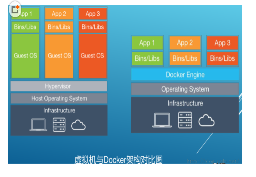

# Docker简介

https://zhuanlan.zhihu.com/p/75694572

## Docker是什么

### Docker出现的原因

一款产品从开发到上线，从操作系统，到运行环境，再到应用配置。作为开发+运维之间的协作我们需要关心很多东西，这也是很多互联网公司都不得不面对的问题，特别是各种版本的迭代之后，不同版本环境的兼容，对运维人员都是考验
Docker之所以发展如此迅速，也是因为它对此给出了一个标准化的解决方案。
环境配置如此麻烦，换一台机器，就要重来一次，费力费时。很多人想到，能不能从根本上解决问题，软件可以带环境安装？也就是说，安装的时候，把原始环境一模一样地复制过来。开发人员利用 Docker 可以消除协作编码时“在我的机器上可正常工作”的问题。


之前在服务器配置一个应用的运行环境，要安装各种软件，就拿尚硅谷电商项目的环境来说吧，Java/Tomcat/MySQL/JDBC驱动包等。安装和配置这些东西有多麻烦就不说了，它还不能跨平台。假如我们是在 Windows 上安装的这些环境，到了 Linux 又得重新装。况且就算不跨操作系统，换另一台同样操作系统的服务器，要移植应用也是非常麻烦的。

传统上认为，软件编码开发/测试结束后，所产出的成果即是程序或是能够编译执行的二进制字节码等(java为例)。而为了让这些程序可以顺利执行，开发团队也得准备完整的部署文件，让维运团队得以部署应用程式，开发需要清楚的告诉运维部署团队，用的全部配置文件+所有软件环境。不过，即便如此，仍然常常发生部署失败的状况。Docker镜像的设计，使得Docker得以打破过去「程序即应用」的观念。透过镜像(images)将作业系统核心除外，运作应用程式所需要的系统环境，由下而上打包，达到应用程式跨平台间的无缝接轨运作。

### Docker理念

Docker是基于Go语言实现的云开源项目。
Docker的主要目标是“Build，Ship and Run Any App,Anywhere”，也就是通过对应用组件的封装、分发、部署、运行等生命周期的管理，使用户的APP（可以是一个WEB应用或数据库应用等等）及其运行环境能够做到“一次封装，到处运行”。


Linux 容器技术的出现就解决了这样一个问题，而 Docker 就是在它的基础上发展过来的。将应用运行在 Docker 容器上面，而 Docker 容器在任何操作系统上都是一致的，这就实现了跨平台、跨服务器。只需要一次配置好环境，换到别的机子上就可以一键部署好，大大简化了操作。

解决了运行环境和配置问题软件容器，方便做持续集成并有助于整体发布的容器虚拟化技术。

## Docker能干嘛

### 之前的虚拟机技术

虚拟机（virtual machine）就是带环境安装的一种解决方案。
它可以在一种操作系统里面运行另一种操作系统，比如在Windows 系统里面运行Linux 系统。应用程序对此毫无感知，因为虚拟机看上去跟真实系统一模一样，而对于底层系统来说，虚拟机就是一个普通文件，不需要了就删掉，对其他部分毫无影响。这类虚拟机完美的运行了另一套系统，能够使应用程序，操作系统和硬件三者之间的逻辑不变。也就是虚拟机会模拟硬件，然后在模拟硬件上运行一个完整的操作系统。

虚拟机的缺点：
1    资源占用多             2    冗余步骤多            3    启动慢

### 容器虚拟化技术

由于前面虚拟机存在这些缺点，Linux 发展出了另一种虚拟化技术：Linux 容器（Linux Containers，缩写为 LXC）。
Linux 容器不是模拟一个完整的操作系统，而是对进程进行隔离。有了容器，就可以将软件运行所需的所有资源打包到一个隔离的容器中。容器与虚拟机不同，不需要捆绑一整套操作系统，只需要软件工作所需的库资源和设置。系统因此而变得高效轻量并保证部署在任何环境中的软件都能始终如一地运行。

比较了 Docker 和传统虚拟化方式的不同之处：
1.传统虚拟机技术是虚拟出一套硬件后，在其上运行一个完整操作系统，在该系统上再运行所需应用进程；
2.而容器内的应用进程直接运行于宿主的内核，容器内没有自己的内核，而且也没有进行硬件虚拟。因此容器要比传统虚拟机更为轻便。                                                                                                                                                                       3.每个容器之间互相隔离，每个容器有自己的文件系统 ，容器之间进程不会相互影响，能区分计算资源。

### DevOps (开发/运维)

1. 更快速的应用交付和部署

   传统的应用开发完成后，需要提供一堆安装程序和配置说明文档，安装部署后需根据配置文档进行繁杂的配置才能正常运行。Docker化之后只需要交付少量容器镜像文件，在正式生产环境加载镜像并运行即可，应用安装配置在镜像里已经内置好，大大节省部署配置和测试验证时间。

2. 更便捷的升级和扩缩容

   随着微服务架构和Docker的发展，大量的应用会通过微服务方式架构，应用的开发构建将变成搭乐高积木一样，每个Docker容器将变成一块“积木”，应用的升级将变得非常容易。当现有的容器不足以支撑业务处理时，可通过镜像运行新的容器进行快速扩容，使应用系统的扩容从原先的天级变成分钟级甚至秒级。

3. 更简单的系统运维

   应用容器化运行后，生产环境运行的应用可与开发、测试环境的应用高度一致，容器会将应用程序相关的环境和状态完全封装起来，不会因为底层基础架构和操作系统的不一致性给应用带来影响，产生新的BUG。当出现程序异常时，也可以通过测试环境的相同容器进行快速定位和修复。

4. 更高效的计算资源利用

   Docker是内核级虚拟化，其不像传统的虚拟化技术一样需要额外的Hypervisor支持，所以在一台物理机上可以运行很多个容器实例，可大大提升物理服务器的CPU和内存的利用率。

# Docker安装

## Docker基本组成


1. 镜像（image）

   Docker 镜像（Image）就是一个只读的模板。镜像可以用来创建 Docker 容器，一个镜像可以创建很多容器。

2. 容器（container）

   Docker 利用容器（Container）独立运行一个或一组应用。容器是用镜像创建的运行实例。

   它可以被启动、开始、停止、删除。每个容器都是相互隔离的、保证安全的平台。

   可以把容器看做是一个简易版的 Linux 环境（包括root用户权限、进程空间、用户空间和网络空间等）和运行在其中的应用程序。

   容器的定义和镜像几乎一模一样，也是一堆层的统一视角，唯一区别在于容器的最上面那一层是可读可写的。

3. 仓库（repository）

   仓库（Repository）是集中存放镜像文件的场所。
   仓库(Repository)和仓库注册服务器（Registry）是有区别的。仓库注册服务器上往往存放着多个仓库，每个仓库中又包含了多个镜像，每个镜像有不同的标签（tag）。

   仓库分为公开仓库（Public）和私有仓库（Private）两种形式。
   最大的公开仓库是 Docker Hub(https://hub.docker.com/)，
   存放了数量庞大的镜像供用户下载。国内的公开仓库包括阿里云 、网易云 等

总结

 Docker 本身是一个容器运行载体或称之为管理引擎。我们把应用程序和配置依赖打包好形成一个可交付的运行环境，这个打包好的运行环境就似乎 image镜像文件。只有通过这个镜像文件才能生成 Docker 容器。image 文件可以看作是容器的模板。Docker 根据 image 文件生成容器的实例。同一个 image 文件，可以生成多个同时运行的容器实例。

*  image 文件生成的容器实例，本身也是一个文件，称为镜像文件。
*  一个容器运行一种服务，当我们需要的时候，就可以通过docker客户端创建一个对应的运行实例，也就是我们的容器
*  至于仓储，就是放了一堆镜像的地方，我们可以把镜像发布到仓储中，需要的时候从仓储中拉下来就可以了。

## CentOS7安装Docker

https://www.cnblogs.com/yufeng218/p/8370670.html 安装教程

https://docs.docker.com/install/linux/docker-ce/centos/ 注意要忽略

1. 通过 **uname -r** 命令查看你当前的内核版本

2. 使用 `root` 权限登录 Centos。确保 yum 包更新到最新。 

   ```
   sudo yum update
   ```

3. 安装需要的软件包 

   ```
   sudo yum install -y yum-utils device-mapper-persistent-data lvm2
   ```

4. 设置yum源 

   ```
   yum-config-manager --add-repo http://mirrors.aliyun.com/docker-ce/linux/centos/docker-ce.repo
   ```

5. 安装最新版的docker，docker-ce和docker-ce-cli这两个可以分别指定版本

   ```
   sudoyum install docker-ce docker-ce-cli containerd.io
   ```

6. 启动并加入开机启动

   ```
   sudo systemctl start docker 启动
   sudo systemctl enable docker 开机启动
   ```

7. 验证安装是否成功(有client和service两部分表示docker安装启动都成功了) 

   ```
   docker version
   ```

8. 配置阿里云镜像加速

   https://cr.console.aliyun.com/cn-hangzhou/instances/mirrors


## 底层原理

### Docker是怎么工作的

Docker是一个Client-Server结构的系统，Docker守护进程运行在主机上， 然后通过Socket连接从客户端访问，守护进程从客户端接受命令并管理运行在主机上的容器。 容器，是一个运行时环境，就是我们前面说到的集装箱。


### Docker比虚拟机快的原因

(1)docker有着比虚拟机更少的抽象层。由亍docker不需要Hypervisor实现硬件资源虚拟化,运行在docker容器上的程序直接使用的都是实际物理机的硬件资源。因此在CPU、内存利用率上docker将会在效率上有明显优势。

(2)docker利用的是宿主机的内核,而不需要Guest OS。因此,当新建一个容器时,docker不需要和虚拟机一样重新加载一个操作系统内核。仍而避免引寻、加载操作系统内核返个比较费时费资源的过程,当新建一个虚拟机时,虚拟机软件需要加载Guest OS,返个新建过程是分钟级别的。而docker由于直接利用宿主机的操作系统,则省略了返个过程,因此新建一个docker容器只需要几秒钟。




# Docker常用命令


attach    Attach to a running container                 # 当前 shell 下 attach 连接指定运行镜像
build     Build an image from a Dockerfile              # 通过 Dockerfile 定制镜像
commit    Create a new image from a container changes   # 提交当前容器为新的镜像
cp        Copy files/folders from the containers filesystem to the host path   #从容器中拷贝指定文件或者目录到宿主机中
create    Create a new container                        # 创建一个新的容器，同 run，但不启动容器
diff      Inspect changes on a container's filesystem   # 查看 docker 容器变化
events    Get real time events from the server          # 从 docker 服务获取容器实时事件
**exec**      Run a command in an existing container        # 在已存在的容器上运行命令
export    Stream the contents of a container as a tar archive   # 导出容器的内容流作为一个 tar 归档文件[对应 import ]
history   Show the history of an image                  # 展示一个镜像形成历史
images    List images                                   # 列出系统当前镜像
import    Create a new filesystem image from the contents of a tarball # 从tar包中的内容创建一个新的文件系统映像[对应export]
info      Display system-wide information               # 显示系统相关信息
inspect   Return low-level information on a container   # 查看容器详细信息
kill      Kill a running container                      # kill 指定 docker 容器
load      Load an image from a tar archive              # 从一个 tar 包中加载一个镜像[对应 save]
login     Register or Login to the docker registry server    # 注册或者登陆一个 docker 源服务器
logout    Log out from a Docker registry server          # 从当前 Docker registry 退出
logs      Fetch the logs of a container                 # 输出当前容器日志信息
port      Lookup the public-facing port which is NAT-ed to PRIVATE_PORT    # 查看映射端口对应的容器内部源端口
pause     Pause all processes within a container        # 暂停容器
ps        List containers                               # 列出容器列表
pull      Pull an image or a repository from the docker registry server   # 从docker镜像源服务器拉取指定镜像或者库镜像
push      Push an image or a repository to the docker registry server    # 推送指定镜像或者库镜像至docker源服务器
restart   Restart a running container                   # 重启运行的容器
rm        Remove one or more containers                 # 移除一个或者多个容器
rmi       Remove one or more images             # 移除一个或多个镜像[无容器使用该镜像才可删除，否则需删除相关容器才可继续或 -f 强制删除]
run       Run a command in a new container              # 创建一个新的容器并运行一个命令
save      Save an image to a tar archive                # 保存一个镜像为一个 tar 包[对应 load]
search    Search for an image on the Docker Hub         # 在 docker hub 中搜索镜像
start     Start a stopped containers                    # 启动容器
stop      Stop a running containers                     # 停止容器
tag       Tag an image into a repository                # 给源中镜像打标签
top       Lookup the running processes of a container   # 查看容器中运行的进程信息
unpause   Unpause a paused container                    # 取消暂停容器
version   Show the docker version information           # 查看 docker 版本号
wait      Block until a container stops, then print its exit code   # 截取容器停止时的退出状态值

# Docker镜像

## 镜像原理

### 联合文件系统

UnionFS（联合文件系统）：Union文件系统（UnionFS）是一种分层、轻量级并且高性能的文件系统，它支持对文件系统的修改作为一次提交来一层层的叠加，同时可以将不同目录挂载到同一个虚拟文件系统下(unite several directories into a single virtual filesystem)。Union 文件系统是 Docker 镜像的基础。镜像可以通过分层来进行继承，基于基础镜像（没有父镜像），可以制作各种具体的应用镜像。

特性：一次同时加载多个文件系统，但从外面看起来，只能看到一个文件系统，联合加载会把各层文件系统叠加起来，这样最终的文件系统会包含所有底层的文件和目录

###  镜像加载原理

docker的镜像实际上由一层一层的文件系统组成，这种层级的文件系统叫UnionFS。

bootfs(boot file system)主要包含bootloader和kernel, bootloader主要是引导加载kernel, Linux刚启动时会加载bootfs文件系统，在Docker镜像的最底层是bootfs。这一层与我们典型的Linux/Unix系统是一样的，包含boot加载器和内核。当boot加载完成之后整个内核就都在内存中了，此时内存的使用权已由bootfs转交给内核，此时系统也会卸载bootfs。 

rootfs (root file system) ，在bootfs之上。包含的就是典型 Linux 系统中的 /dev, /proc, /bin, /etc 等标准目录和文件。rootfs就是各种不同的操作系统发行版，比如Ubuntu，Centos等等。


对于一个精简的OS，rootfs可以很小，只需要包括最基本的命令、工具和程序库就可以了，因为底层直接用Host的kernel，自己只需要提供 rootfs 就行了。由此可见对于不同的linux发行版, bootfs基本是一致的, rootfs会有差别, 因此不同的发行版可以公用bootfs。

### 为什么Docker镜像要采用分层的结构

最大的一个好处就是 - 共享资源

比如：有多个镜像都从相同的 base 镜像构建而来，那么宿主机只需在磁盘上保存一份base镜像，

同时内存中也只需加载一份 base 镜像，就可以为所有容器服务了。而且镜像的每一层都可以被共享。

### 镜像的特点

Docker镜像都说只读的，当容器启动时，一个新的可写层被加载到镜像的顶部，这一层被称为容器层，容器层之下叫镜像层。

# Docker容器数据卷

## 容器数据卷是什么

先来看看Docker的理念：

\*  将运用与运行的环境打包形成容器运行 ，运行可以伴随着容器，但是我们对数据的要求希望是持久化的

\*  容器之间希望有可能共享数据 

Docker容器产生的数据，如果不通过docker commit生成新的镜像，使得数据做为镜像的一部分保存下来，

那么当容器删除后，数据自然也就没有了。

为了能保存数据在docker中我们使用卷。

## 能用来干嘛

可以实现容器的持久化和容器间的**继承**+共享数据

卷就是目录或文件，存在于一个或多个容器中，由docker挂载到容器，但不属于联合文件系统，因此能够绕过Union File System提供一些用于持续存储或共享数据的特性：

 卷的设计目的就是数据的持久化，完全独立于容器的生存周期，因此Docker不会在容器删除时删除其挂载的数据卷

特点：

1：数据卷可在容器之间共享或重用数据

2：卷中的更改可以直接生效

3：数据卷中的更改不会包含在镜像的更新中

4：数据卷的生命周期一直持续到没有容器使用它为止

## 添加方式

### 1. 直接命令添加

docker run -it -v /宿主机目录:/容器内目录 centos /bin/bash，目录不存在的话会自动生成，容器停止后重新启动后会同步停止期间产生的数据变化，还可以设置容器目录内的权限，比如设置只读，则容器访问这个目录只能读取，宿主机在这个目录可以正常读写。

### 2. DockerFile添加

**说明**：

VOLUME["/dataVolumeContainer","/dataVolumeContainer2","/dataVolumeContainer3"]

出于可移植和分享的考虑，用-v 主机目录:容器目录这种方法不能够直接在Dockerfile中实现。

由于宿主机目录是依赖于特定宿主机的，并不能够保证在所有的宿主机上都存在这样的特定目录。


1. 新建一个文件dockerfile2，在文件中写入以下命令

\# volume test

FROM centos

VOLUME ["/dataVolumeContainer1","/dataVolumeContainer2"]

CMD echo "finished,--------success1"

CMD /bin/bash

2. bulid之后生成一个新镜像new/centos

docker build -f dockerfile2 -t new/centos

3. 利用新镜像生成容器

docker run -it new/centos /bin/bash 

4. 通过docker inspect 容器号查看数据卷对应的宿主目录（最新版的centos是在返回的json数据中的mount字段查看）

5. 如果Docker挂载主机目录Docker访问出现cannot open directory .: Permission denied

解决办法：在挂载目录后多加一个--privileged=true参数即可

# 数据卷容器

## 什么是数据卷容器

父容器挂载数据卷，其它容器通过挂载这个(父容器)实现数据共享，挂载数据卷的容器，称之为数据卷容器。

父容器dc1在宿主机挂载两个数据卷，dc2和dc3数据卷继承dc1，即使dc1删了，dc2和dc3之间也可以数据共享，数据卷的生命周期一直持续到没有容器使用它为止。

# DockerFile

## 什么是DockerFile

DockerFile是用来构建Docker镜像的构建文件，是有一系列命令和参数构成的脚本。

## DockerFile构建的步骤

编写DockerFile文件，使用build命令构建新镜像，使用run命令生成容器。

## DockerFile构建过程解析

### Dockerfile内容基础知识


### Docker执行Dockerfile的大致流程


### 为什么要用Dockerfile

从应用软件的角度来看，Dockerfile、Docker镜像与Docker容器分别代表软件的三个不同阶段，

\*  Dockerfile是软件的原材料

\*  Docker镜像是软件的交付品

\*  Docker容器则可以认为是软件的运行态。

Dockerfile面向开发，Docker镜像成为交付标准，Docker容器则涉及部署与运维，三者缺一不可，合力充当Docker体系的基石。

1 Dockerfile，需要定义一个Dockerfile，Dockerfile定义了进程需要的一切东西。Dockerfile涉及的内容包括执行代码或者是文件、环境变量、依赖包、运行时环境、动态链接库、操作系统的发行版、服务进程和内核进程(当应用进程需要和系统服务和内核进程打交道，这时需要考虑如何设计namespace的权限控制)等等; 

2 Docker镜像，在用Dockerfile定义一个文件之后，docker build时会产生一个Docker镜像，当运行 Docker镜像时，会真正开始提供服务;

3 Docker容器，容器是直接提供服务的。


