# 1. 第一课

## 1.1 脑图

数据结构脑图：https://naotu.baidu.com/file/b832f043e2ead159d584cca4efb19703?token=7a6a56eb2630548c

算法脑图：https://naotu.baidu.com/file/0a53d3a5343bd86375f348b2831d3610?token=5ab1de1c90d5f3ec

## 1.2 学习目标

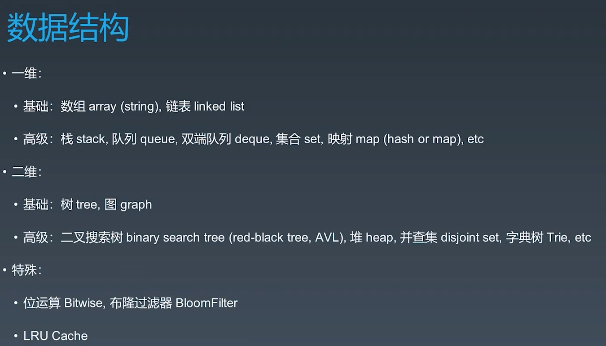

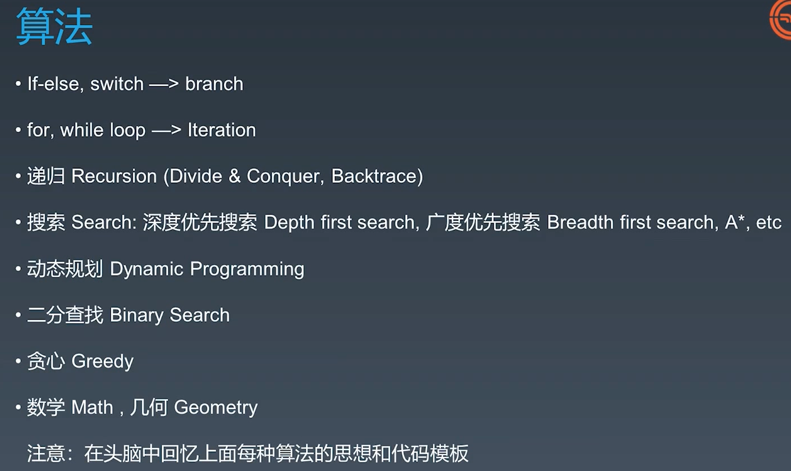

## 1.3 刷题方法

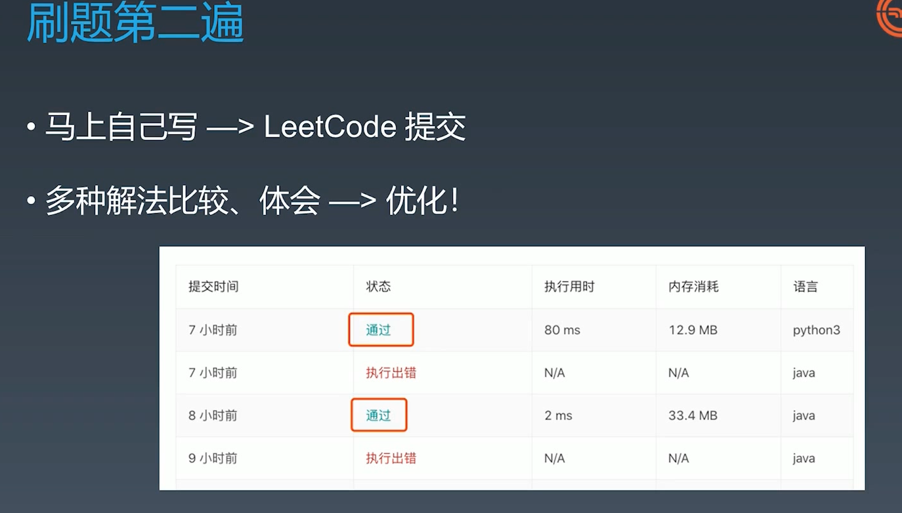

第三遍： 第二天再做一边

第四遍： 第二周再做一遍

第五遍：面试前一周再做一遍

## 1.4 mac快捷键

command加空格搜索keyboard ，将值都调到最右

行头行尾 command + left/right

删除单词option + delete

选中整行 shift + command + left/right

# 2. 第二课

## 2.1 自顶向下编程法

## 2.2 时间复杂度

### 2.2.1 时间复杂度

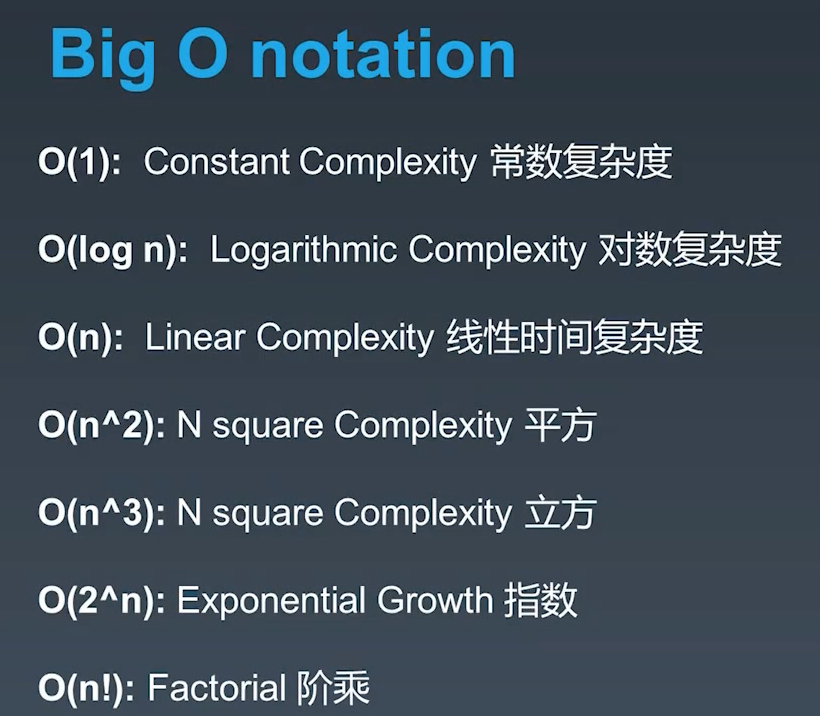

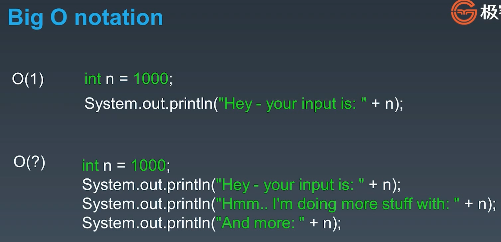

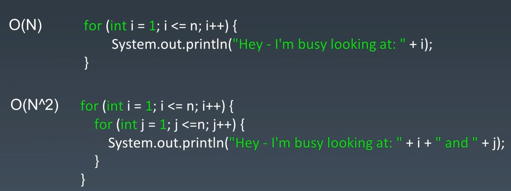

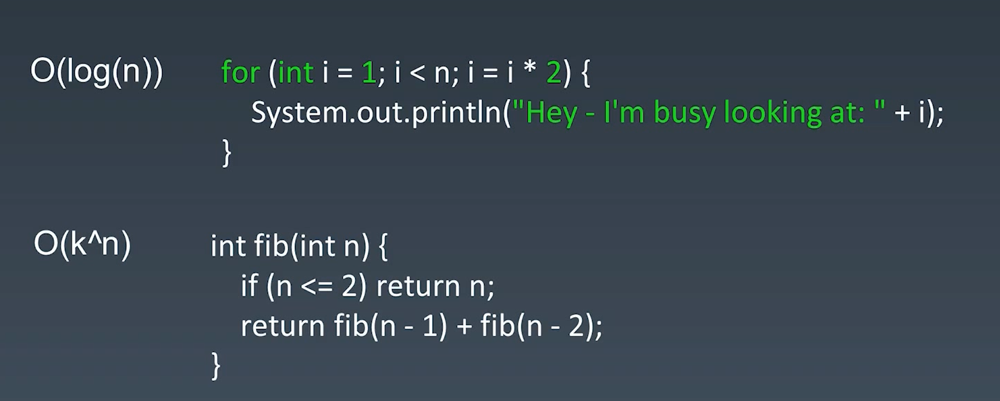

#### 2.2.1.1 递归的时间复杂度

二分查找

二叉树遍历

最优有序矩阵查找

归并排序

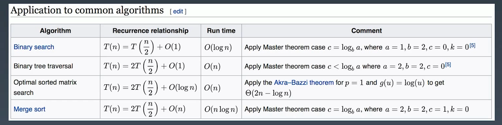

#### 2.2.1.2 时间复杂度的一些题目

1. 二叉树的前、中、后遍历时间复杂度都是O(n)，因为每个节点只遍历一次
2. 图的时间复杂度也是O(n)
3. DFS、BFS的时间复杂度是O(n)
4. 二分查找的时间复杂度是O(logn)

# 3. 第三课

## 3.1 数组、链表、跳表

### 3.1.1 跳表

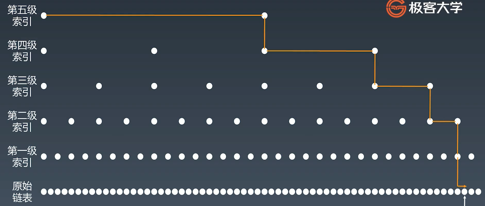

跳表是为了解决链表查找时间复杂度为O(n)的问题（通过升维（变成了二维空间）和空间换时间）,当然跳表也存在着维护和空间的问题

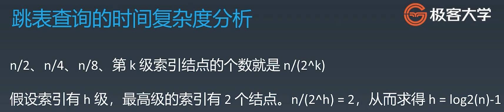

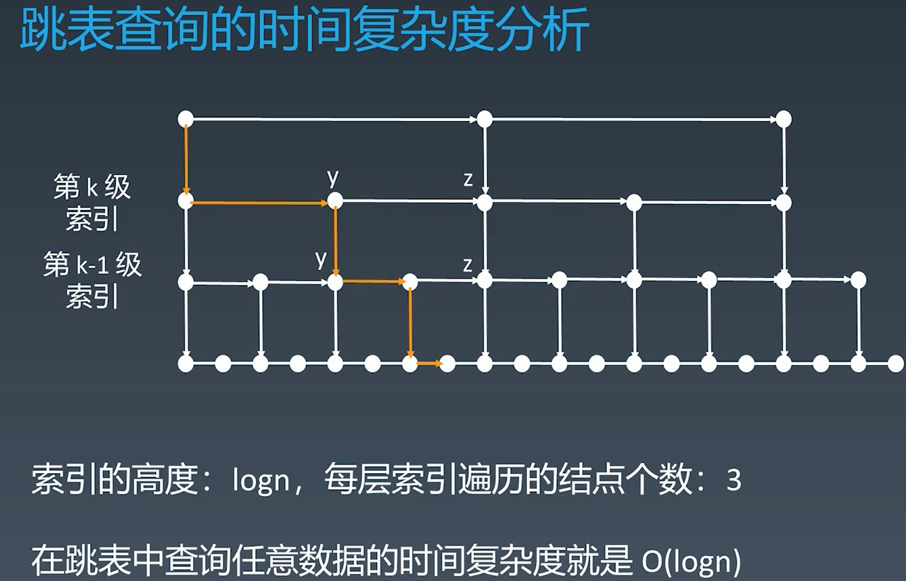

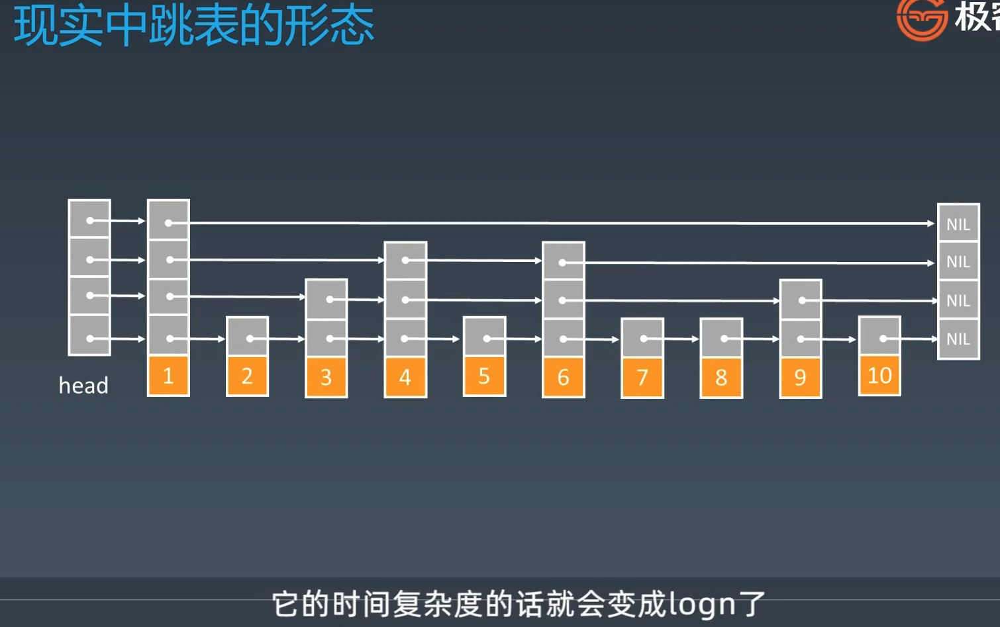

**因为跳表添加删除的时候需要维护索引，使用添加和删除的时间复杂度上升到了logn**

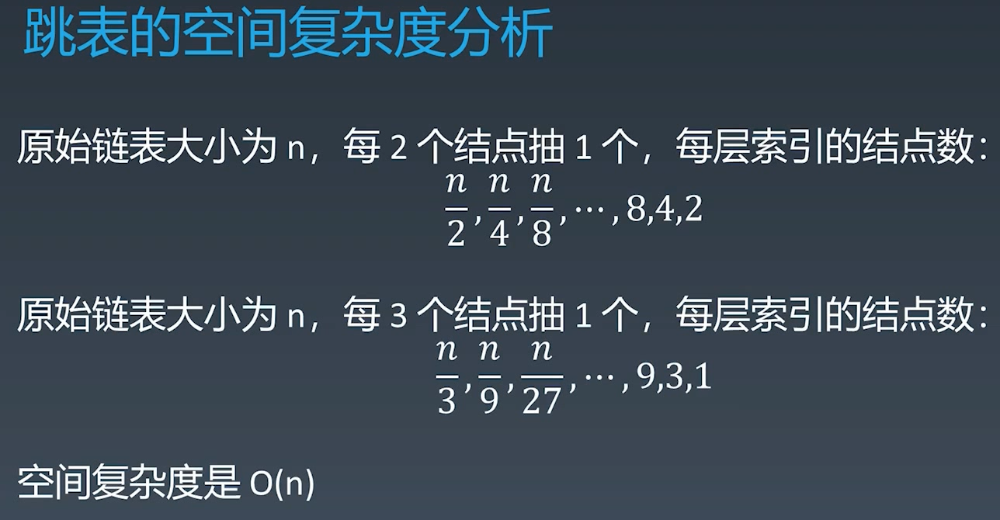

### 3.1.2 工程中的应用

LinkedList: LRU

Redis跳跃表：https://redisbook.readthedocs.io/en/latest/internal-datastruct/skiplist.html

· [为啥 Redis 使用跳表（Skip List）而不是使用 Red-Black？](http://www.zhihu.com/question/20202931)

### 3.1.3 Array题目实战

**解题思路**：**左右夹逼（注意一般要排序才可以）**，找重复，**利用指针**

283移动零：https://leetcode-cn.com/problems/move-zeroes/

11盛最多水的容器：https://leetcode-cn.com/problems/container-with-most-water/

70爬楼梯：https://leetcode-cn.com/problems/climbing-stairs/

1两数之和：https://leetcode-cn.com/problems/two-sum/

15三数之和：https://leetcode-cn.com/problems/3sum/

#### 3.1.4 链表题目实战

206反转链表：https://leetcode-cn.com/problems/reverse-linked-list/ (递归方式的时间和空间复杂度都为O(n))

24两两交换链表中的节点：https://leetcode-cn.com/problems/swap-nodes-in-pairs/