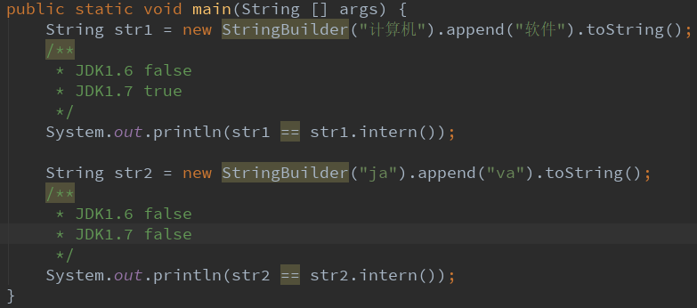
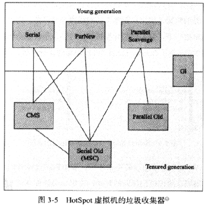

---

---
# 第一部分 走近Java

# 第二部分 自动内存管理机制

## 第２章 java内存区域与内存溢出异常

###  2.1 概述

​	该章主要介绍java虚拟机内存的各个区域，讲解各个区域的作用、服务对象以及其中可能产生的问题。

> 内存溢出：程序申请不到足够的内存，在java出现这个问题会报OutOfMemoryError错误。
>
> 内存泄漏： 出现啊申请的内存空间无法释放，内存泄漏堆积会造成内存溢出。

### 2.2 运行时数据区域

​	Java虚拟机在执行Java程序的时候会将它管理的内存划分为几个区域，有的区域会跟着虚拟机进程启动而存在，有的则依赖用户线程的启动和结束而建立和销毁。

​	根据《Java虚拟机规范 SE7版 》规定Java虚拟机管理的内存分为5个区域

1. 线程私有的内存区域：   
   - 虚拟机栈（Virtual Machine  Stacks）
   - 本地方法栈（Native Method Stack）
   - 程序计数器（Program Counter Register）
2. 所有线程共享的内存区域：
   - 方法区 （Method Area）
   - 堆（Heap）

#### 2.2.1 程序计数器

​	可以看做是记录当前线程所执行的字节码（class）的行号指示器，Java虚拟机的多线程是通过轮流切换并分配处理器时间来执行的，因此每个处理器（或者多核处理器的一个内核）在每一刻只会执行一条线程中的指令，因此为了线程切换后能回到正确的执行位置，需要**记录当前线程执行的字节码指令的地址**。

​	如果执行的是Native方法，则这个计数器为空（Undefined）。

​	该内存区域是**唯一一个**在Java虚拟机规范中没有规定任何内存溢出错误的区域。

#### 2.2.2  Java虚拟机栈

​	每个方法执行的同时会创建一个栈帧用于存储局部变量表（储存了编译器可知的各种基本数据类型，如boolean、byte，对象引用（可能是指向引用对象的起始指针，也可能是句柄）和returnAddress类型（指向一条字节码指令的地址））、

操作数栈、动态链接、方法出口等信息，每个方法从开始执行到结束的过程，就对应一个栈帧在虚拟机栈入栈到出栈的过程。

​	该内存区域就是一般在分类Java内存区域时所讲的**栈内存**。

​	64为长度的long和double基本数据类型会占两个局部变量空间，其他基本数据类型只占用一个。

​	由于局部变量表需要的空间在编译期间就已经确定好了，因此这个方法需要需要在**帧**中需要分配多大的局部变量空间是完全确定的，在**运行期间不会改变**。

​	Java虚拟机规范对这个区域规定了两种异常状况

> 栈溢出错误（StackOverflowError）异常:线程请求的栈深度大于虚拟机所允许的深度。
>
> 内存溢出错误（OutOfMemoryError）异常:**虚拟机栈**扩展时申请不到足够的内存。

#### 2.2.3 本地方法栈

​	和虚拟机栈发挥的作用非常相似，为虚拟机执行的Native方法服务，有的虚拟机会把虚拟机栈和本地方法栈和在一起，该区域也规定了两种异常状况。

#### 2.2.4 Java堆

> JIT编译器（just in time compiler）:即使编译器，将使用次数频繁（例如循环）的代码编译成与本地平台相关的机器码

​	Java堆是Java虚拟机所管理的内存中最大的一块（最小的是程序计数器），该区域用于保存对象实例以及数组，随着技术的发展，不是所有对象都分配在堆上了（JIT编译后的代码会放在方法区）。

​	从内存回收的角度看，Java堆可以分为新生代和老年代，新生代还可以细分为（Eden、From Survivor、 To Survivor，系统默认配置比例是8:1:1）

​	从内存分配的角度看，线程共享的Java堆还可以分为多个线程私有的分配缓冲区（Thread Local Allocation Bufffer,TLAB，本地线程分配缓冲），由于对象创建在虚拟机中是非常频繁的行为，即使是修改一个指针指向的位置，在并发情况下也不是线程安全的，可能出现正在给A分配内存，指针还没来得及修改，对象B又同时使用了原来的指针来分配内存（指针指向一块内存）的情况。这个问题有两种解决方法:一是对分配内存空间的动作进行同步处理，二是每个线程在Java堆中预先分配一小块内存，哪个内存要分配内存，就在哪个线程的TLAB上分配，当TLAB用完需要重新分配新的TLAB时才需要**同步锁定**。

​	Java堆可以处于物理上不连续的内存空间中，只要逻辑上是连续的即可。

#### 2.2.5 方法区

​	用于存储**已被虚拟机加载的类信息**、常量、静态变量、即时编译器（JIT编译器）编译后的代码等数据，虽然Java虚拟机把方法区描述为堆的一个逻辑部分，但是它却有一个别名叫非堆（None-Heap）,目的应该是与Java堆区分开。

​	根据Java虚拟机规范，当方法区无法满足内存的分配需求时，将抛出OutOfMemoryError异常。

#### 2.2.6 运行时常量池

​	运行时常量池(Runtime Constant Pool)是方法区的一部分，Class文件中除了有类的版本、字段、方法和接口等描述外，还有一项信息是常量池，用于保存编译期生成的各种字面量和符号引用，这部分内容将在类加载后进入方法区的运行时常量池中存放。

​	运行时常量池相对于**Class文件常量池**的另一个重要特性即是具备动态性，Java并不要求常量一定只有编译期才能产生，也就是并非只有预置在Class文件常量池中的内容才能进入方法区运行时常量池，运行时也可以，例如String类的intern（）方法。

​	运行时常量池是方法区的一部分，会受到方法区内存的限制，但常量池无法申请到足够的内存时抛出OutOfMemoryError异常。

#### 2.2.7 直接内存

​	直接内存（Direct Memory）并不是虚拟机运行时数据区的一部分，也不是虚拟机规范中规定的内存区域。

​	在JDK1.4中新加入了NIO类，它可以使用Native函数库直接分配堆外内存，然后通过一个存储在Java堆中的DirectByteBuffer对象作为这块内存的引用进行操作，这样就避免了在Java堆和Native堆中来回复制数据。

​	管理员在配置虚拟机参数时，往往会忽略了直接内存，从而导致了各个内存区域总和大于物理内存限制（包括物理和操作系统的限制），从而导致虚拟机动态扩展时出现OutOfMemoryError异常。

### 2.3 HotSpot虚拟机对象探秘

​	在了解了各个内存区域放在内容后，以HotSpot和Java堆为例，探讨HotSpot虚拟机在Java堆中对象分配、布局和访问的全过程（仅限于普通Java对象，不包括数组和Class对象等）。

#### 2.3.1 对象的创建

​	1. 虚拟机遇到new指令时，会检查这个指令的参数是否能在运行时常量池中定位到一个类的符号引用，并且检查这个符号引用代表的类是否已被加载、解析和初始化过，如果没有，则执行相应的类加载过程（第7章探讨）。

​	2. 类加载检查通过后，虚拟机会为新生代对象分配内存（对象经过几次GC后如果仍存在则会被加入到老年代中），根据Java堆的内存是否规整（是否规整主要看采用的**垃圾收集器**是否带压缩功能，带压缩的话GC后内存是规整的），分配内存有两种方式：

​	一是“指针碰撞”，将内存分为用过的和空闲的两边，中间放着一个指针作为分界点的指示器，当为对象分配内存时，指针就往空闲那边的内存挪一段与 对象大小相等的距离；

​	二如果内存不是规整的，则使用“空闲列表”分配方式，虚拟机维护一个表，记录哪些内存是可用的，在分配的时候从列表中找出可用的内存块，并更新表的记录。

​	3. 为了在并发情况下保证分配内存的动作是线程安全的，有两种方式，具体在2.2.4中有写到。

​	4. 分配完内存后，虚拟机需要将分配到的内存空间都初始化为零值（默认值），不包括对象头，如果是先TLAB上分配内存，则初始化也可以先在TLAB上进行。

​	5. 接下来虚拟机设置对象的对象头信息，例如对象是哪个类的实例、如何才能找到类的元数据信息、对象的哈希码、对象的GC分代年龄等。

​	6. 接下来执行对象的init方法（构造）

	7. 将对象引用入栈（具体过程 代码可看书中P46）

#### 2.3.2 对象的内存布局

​	对象在内存中存储的布局可以分为3块区域：对象头、实例数据和对齐填充。

​	1. 对象头：对象头包括两部分信息，一是存储对象自身的运行时数据，例如GC分代年龄、哈希码这些；二是类型指针，即对象指向它的类元数据的指针，通过这个来确定它是哪一个类的实例，并不是所有的虚拟机都在对象头中保存类型指针；如果对象是一个数组，那对象头中还必须有一块记录数组长度（大小）的数据，普通的java对象可以通过元数据信息确定java对象的大小。  

​	2. 实例数据保存的是代码中定义的各种类型的字段内容，无论是父类继承的，还是子类定义的，都会记录在这，收到虚拟机分配策略的影响，系统宽度的字段总是被分配到一起，因此并不一定是按定义的顺序来分配的。

​	3. 对齐填充并不必然存在，HotSpot要求对象的起始地址必须是8字节的整数倍，对象头刚好是8字节的倍数，只有实例数据需要填充。

#### 2.3.3 对象的访问定位

​	java程序只需要通过栈上的reference数据来操作堆上的具体对象，虚拟机规范只规定了reference指向一个对象的引用，并没有规定该通过何种方式去定位、访问堆中的对象的具体位置，因此主流有句柄和直接指针两种。

​	1.句柄方式:方便对象移动，移动后只需要修改句柄中的实例数据指针。

​	2.直接指针：有利于访问，可以节省一次指针定位的时间，HotSpot是使用这种方式。

### 2.4 实战: OutOfMemoryError异常

#### 2.4.1 Java堆溢出

​	通过不断地创建对象，达到最大堆容量限制后就会产生内存溢出异常。

#### 2.4.2 虚拟机栈和本地方法栈溢出

>如果线程请求的栈深度大于虚拟机所允许的最大深度，将抛出StackOverflowError异常。
>
>如果虚拟机在扩展栈时无法申请到足够的内存空间，则抛出OutOfMemoryError异常。

​	定义大量的本地变量，不断增加方法帧中本地变量表的长度，不断地让方法栈帧入栈。

#### 2.4.3 方法区和运行时常量池溢出

​	运行时常量池是方法区的一部分，从JDK1.7开始逐步”去永久代“。

​	String.intern()方法是一个Native(本地)方法。在JDK1.6中，intern（）方法会把首次遇到的字符串实例复制到方法区，然后返回方法区这个字符串实例的引用，而StringBuilder创建的字符串实例在java堆上，所以肯定不是同一个引用，结果两条都是false。

​	而在JDK1.7中，intern（）方法不会再复制实例，只是在常量池中记录**首次**出现的的实例的引用，返回的也是  原来实例的引用，因此在JDK1.7中运行第一个结果是true,第二个结果是false,因为java这个字符串在常量池中不是首次出现了。

​	方法区用于存放Class的相关信息，如类名、访问修饰符、常量池、字段描述、方法描述等。通过运行时产生大量的类去填满方法区，直到溢出。

#### 2.4.4 本机直接内存溢出

### 2.5 本章小结 

​	本章学习了java内存区域的划分、非Java内存区域（如直接内存）、每个区域的作用以及如何让该区域出现溢出异常。

## 第3章 垃圾收集器与内存分配策略

### 3.1 概述

​	在java内存区域中，程序计数器、虚拟机栈、本地方法栈这3个区域随着线程而生，随线程而灭；栈中的栈帧随着方法的进入和退出而有条不紊地执行着入栈和出栈操作。每一个栈帧应该分配多少内存在编译的时候将是已经确定的了（尽管在运行期间会由JIT编译器进行一些优化，但在概念模型的讨论中，基本可以认为是编译期可知的）。因此这几个区域的内存分配和内存回收都具备确定性，只要方法结束或者线程结束，内存自然就被回收了。

​	而java堆和方法区则不一样，一个接口中多个实现类需要的内存可能不一样，一个方法中的多个分支需要的内存也可能不一样，只有在程序处于运行期间才能知道会创建哪些东西，这部分的内存的分配和回收都是动态的，因此垃圾回收器关注的是这一部分的内存回收。

### 3.2 判断对象是否对象已死

#### 3.2.1 引用计数法

​	给对象添加一个引用计数器，每当有一个地方引用他时，计数器就加1，当引用失效时，计数器就减1；如何时刻计数器为0的对象就是不可能再被使用的，可以被回收。

​	缺点：很难解决对象之间相互循环引用的问题。（书中P63代码）

#### 3.2.2 可达性分析算法

​	通过一系列被称为“GC Roots”的对象作为起始点，从这些节点开始向下搜索，搜索所走过的路径被称为引用链（Reference Chain）,当一个对象到GC Roots没有任何引用链相连的话（就是说不可达），就说明该对象是可回收的。

​	在Java中，可以作为GC Roots的对象包括以下几种

 - 虚拟机栈（栈帧中的本地变量表）中引用的对象
 - 方法区中类静态属性引用的对象
 - 方法区中常量引用的对象
 - 本地方法栈中JIT（即一般说的Native方法）引用的对象

#### 3.2.3 再谈引用

​	在JDK1.2之后，java对引用的概念进行了扩充，将引用分为了4种

1. 强引用（Strong Reference）:类似"Object obj = new Object()"这类的引用，只要强引用还存在，垃圾收集器永远不会回收被引用的对象。
2. 软引用（Soft Reference）:用来描述一些还有用但并非必需的对象，在系统将要发送内存溢出异常之前，将会把这些软引用关联的对象列进回收范围之中进行第二次回收，如果这次回收后还没有足够的内存，才会发生内存溢出异常。在JDK1.2后用SoftReference类实现。
3. 弱引用（Weak Reference）:被弱引用关联的对象只能生成到下一次垃圾收集器发生之前，无论内存是否足够，JDK1.2后用WeakReference实现。
4. 虚引用（Phantom Reference）:被虚引用关联的对象其生存时间完全没变，只是在该对象被回收时会收到一个通知，JDK1.2后使用PhantomReference实现。

#### 3.2.4 生存还是死亡

​	判断一个对象是否真正可被回收，需要经过两次标记过程，如果对象在进行可达性分析算法后发现不可达，那它将会被**第一次标记**，然后进行一次筛选（不算第二次标记）。

​	筛选的条件是否有必要执行finalize()方法，当对象没有覆盖finalize()方法，或者对象的finalize()方法已经**被执行过了**，虚拟机则会视为没有必要执行。

​	如果该对象被判定为有必要执行finalize()方法，那个这个对象将会被放置到一个叫F-Queue的队列中，并在稍后由一个由虚拟机创建的、低优先级的Finalizer线程去执行它。但是虚拟机并不会等待对象的finalize方法执行完，因为如果对象的finalize方法执行缓慢，或者死循环，会让F-Queue中的对象永远处于等待状态。因此对象只能在有限的时间与引用链上的任何一个对象建立关联实现自救。

​	稍后GC会对F-Queue中的对象进行第二次标记，如果对象自救成功，则会被移出“即将回收”的集合。

#### 3.2.5 回收方法区

​	永久代的垃圾回收主要回收两部分内容：废弃常量和无用的类。

​	类需要同时满足以下3个条件才能算可回收的类：

- 该类所有的实例已经被回收
- 加载该类的ClassLoader已经被回收
- 该类对应的java.lang.Class对象没有在任何地方被引用，无法在任何地方通过反射访问该类的方法。

### 3.3 垃圾收集算法

#### 3.3.1 标记-清除算法

​	算法分为标记和清除两个阶段：首先标记所有需要回收的对象，然后统一回收。该算法是最基础的收集算法，后续的算法都是基于这种思路并对其不足的地方改进的。

​	缺点主要有两个：一是效率问题，标记和清除两个过程的效率都不高；二是空间问题，标记清除后会产生大量不连续的内存空间，如果有大对象需要分配而同时又找不到足够大的**连续内存块**分配的话，则会提前触发GC。

#### 3.3.2 复制算法

​	将内存分为两部分，将存话的对象转移到另一部分，然后将剩下的对象全部清除，这样就解决了标记-清除算法留下大量不连续内存的问题。

​	现在许多虚拟机都采用这种收集算法来回收**新生代**，默认将新生代内存分为一块较大的Eden空间和两块较小的Survivor空间，默认比例为8:1:1。

​	每次只使用Eden和一块Survivor,当回收时，将存活的对象转移到另一块Survicor空间，然后清除Eden和使用过的Survicor空间，因此新生代内存只有10%会被“浪费”。

​	一开始只有Eden区有对象数据，第一次GC将存活的对象转移到s0，第二次GC的时候将E和S0里面的存活的对象注意到S1,然后清除E和S0，第三次GC的时候再把E和s1存活的对象转移到S0（在空间分配担保不发生的情况下）。

​	当Survicor空间不够保存存活下来的对象时，需要其他内存（这里指老年代）进行分配担保。

#### 3.3.3 标记-整理算法

​	复制收集算法在对象存活率较高的情况下就要进行较多的复制算法，效率变低。更关键的是，如果不行浪费50%的空间，就需要有额外的空间进行分配担保。

​	因此在对象存活率较高的老年代，一般都是使用标记-整理算法，让所有存活的对象往一端移动，然后清除掉边界外的内存。

#### 3.3.4 分代收集算法

​	根据对象存活**周期**的不同将内存划分为几块，一般是把Java堆分为新生代和老年代。

​	比如新生代对象的存活率低，使用复制算法的话只要付出少量存活对象的复制成本就可以完成收集。

​	而老年代中对象存活率高，没有额外的空间对它进行分配担保，就必须使用“标记-清理”或者“标记-整理”算法来进行回收，一般是用标记-整理算法。

### 3.4 HotSpot的垃圾回收算法实现

#### 3.4.1 枚举根节点(Roots)

​	GC的时候必须停顿所有的java线程（Stop The Workd）,让对象的引用关系停止变化，以保证分析结果准确性。即使是在号称几乎不会发生停顿的CMS收集器中，枚举根节点也是必要停顿的。

​	当执行系统停顿下来后，并不需要一个不漏的检查所有执行上下文和全局的引用位置，虚拟机应当是有方法直接得知哪些地方存放着对象的引用。在HotSpot的实现中，是使用一组称为OopMap的数据结构来达到这个目的，在类加载完成的时候，HotSpot就把对象内什么偏移量上是什么类型的数据计算出来，在JIT编译过程中，也会在特定的位置记录下栈和寄存器中哪些位置是引用。这样GC在扫描时间可以直接得知这些信息了。

#### 3.4.2 安全点

​	在OopMap的协助下，HotSpot可以快速且准确地完成GC Roots枚举，但有一个问题，如果使OopMap内容变化的指令非常多，如果为每一条指令都生成对应的OopMap,就需要大量额外的空间，GC的空间成本将会变得很高。

​	实际HotSpot并没有为每条指令生成OopMap,只是在特定的位置停下，这些位置被称为安全点，即程序到达安全点后才开始GC。

​	在GC发生时有两个方法让所有线程都跑到最近的安全点停顿下来。

- 抢先式中断：在GC发生时，把所有线程都中断，如果发现有线程中断的位置不在安全点上，就恢复线程让它跑到安全点上，现在几乎没有虚拟机使用这种方法。
- 主动式中断：当GC需要中断线程时，并不直接对线程操作，仅设置一个标志，各个线程执行时主动权轮询这个标志，当发现中断标志为真时就中断挂起。

#### 3.4.3 安全区域

###  3.5垃圾收集器

​	JDK1.7HotSpot虚拟机使用的垃圾收集器

> 并行和并发在垃圾收集器的上下文语境中，可以解释如下：
>
> - 并行（Parallel）：指多条垃圾收集器线程并行工作，但此时用户线程仍然处于等待状态。
> - 并发（Concurrent）:指用户线程与垃圾收集线程同时执行（但不一定是并行的，可能会交替执行），用户程序在继续运行，而垃圾收集程序运行于另一个CPU上(或者一个内核)。

#### 3.5.1 Serial收集器

​	JDK1.3之前叫出现了，新生代的收集器，单线程，采用复制算法。

​	这里的单线程的意义不仅仅是它只会使用一个CPU或一条收集线程去完成垃圾收集工作。更重要的是它进行垃圾收集时，必须暂停所有的工作线程（java工作线程）。

#### 3.5.2 ParNew收集器

​	ParNew收集器其实是Serial收集器的多线程版本，新生代的收集器，并行、多线程、采用复制算法。

​	默认开启的线程数与CPU的数量相等。

#### 3.5.3 Paraller Scavenge 收集器 

​	Parraller Scavenge是一个新生代收集器，采用复制算法，拥有和ParNew一样并行、多线程的特点。

​	与CMS等收集器关注点不同，其他收集器是尽可能地缩短垃圾收集时用户线程的停顿时间，而Paraller Scavenge收集器的目的是达到一个可控制的吞吐量。

​	吞吐量 = 运行用户代码时间/ (运行用户代码时间 +　垃圾收集时间)

​	停顿时间越短就越适合需要与用户交互的程序，而高吞吐量则可以高效地利用cpu时间，尽快完成程序的运算任务。

​	Paraller Scavenge收集器提供了两个参数分别控制最大垃圾收集停顿时间和直接设置吞吐量大小(吞吐量倒数P79)。

​	GC停顿时间缩短是以牺牲吞吐量和新生代的空间来换取的，新生代调小，收集速度变快，时间虽然变短了，但GC的次数也相应变多了。

#### 3.5.4 Serial Old收集器

​	Serial Old是Serial的老年代版本，单线程，使用标记-整理算法。

#### 3.5.5 Parallel Old收集器

​	Parallel Old是Parallel Scavenge收集器的老年代版本，多线程，使用标记-整理算法。

#### 3.5.6 CMS收集器

​	CMS（Concurrent Mark Sweep）收集器是一种以获取最短回收停顿时间为目标的收集器，适合B/S架构的服务端，这类的应用尤其讲究服务的响应速度。

​	CMS是老年代的收集器，使用的是“标记-清除”算法，整个过程分为4个步骤，其中初始标记和重新标记这两个步骤仍然需要Stop The World

1. **初始标记**：仅仅只是标记一下GC Roots能直接关联到的对象，速度很快。

2. 并发标记：进行GC Roots Tracing(追踪)

3. **重新标记**：修正并发标记期间因用户程序继续执行导致标记产生变动的那一部分对象的标记记录，这个停顿时间会比初始标记长一点，但远比并发标记时间短（注意新产生的回收对象只能留到下一次GC进行清理）。

4. 并发清除

   整个过程耗时最长的并发标记和并发清除过程收集器都是可以与用户线程一起运行的，所以CMS可以看做是**并发**收集器。

缺点：

1. CMS收集器对CPU资源非常敏感，当CPU数量少时，CMS并发回收时占用的CPU资源比例很高，会严重影响用户程序的执行速度。
2. CMS无法处理浮动垃圾（并发清除时新产生的垃圾），也无法像其他收集器那样等到老年代几乎填满了再去收集，因为需要在老年代预留一部分内存供并发收集时的程序运行使用。如果在设置中老年代预留的内存不够并发程序运行，就会启动Serial Old进行垃圾回收，不过这样会增加停顿时间。
3. 由于采用标记-清除，会留下大量不连续的内存，但CMS会进行内存压缩（合并整理）,整理的过程无法并发。

#### 3.5.7 G1收集器

​	G1收集器是一款面向服务端应用的垃圾收集器，与其他GC收集器相比，拥有如下特点：

1. 并发： G1能充分利用多CPU、多核环境下的硬件优势，使用多个CPU（或者CPU核心）来缩短Stop The World时间。并且仍然可以通过并发的方式让Java程序继续执行。
2. 分代收集：G1能够独立管理整个Java堆，虽然还保留有新生代和老年代的概念，但新生代和老年代不再是物理隔离的了，它将整个Java堆分为多个大小相等的独立区域（Region）,新生代或者老年代都是Region（不需要连续）的集合。
3. 空间整合：与CMS的标记-清理算法不同，G1从整体上看是基于“标记——整理”，从局部（两个Region之间）上看是基于“复制”算法实现的。
4. 可预测的停顿：G1除了追求低停顿外，还能建立可预测的停顿时间模型，指定一个时间片段，消耗在垃圾收集上的时间不得超过该时间段。G1会避免在整个java堆进行全区域的垃圾收集，G1跟踪各个Region里面的垃圾堆积的价值大小，在后台维护一个优先列表，每次根据允许的收集时间，优先回收价值最大的Region。、

​         因为一个Region中对象可能关联着另一个Region中的对象，如果需要对一个Region进行回收时，使用可达性判断可能就需要扫描该Region关联的其他对象的Region才能保证准确性。（其他GC收集器也面临着类似的问题）

​	G1收集器中Region之间对象的引用，以及**其他收集器**中新生代与老年代之间的对象引用，虚拟机都是通过Remembered Set来避免全堆扫描的。

​	G1中每个Region都有一个与之对应的Remembered Set，虚拟机发现程序在对Reference类型的数据进行写操作时，会暂时中断写操作，检查Reference引用的对象是否处于不同的Region之中（在分代中是检查老年代中的对象是否引用了新生代的对象），如果是，则把相关引用信息记录到被引用对象所属的Region的Remembered Set之中，当进行内存回收时，在GC根节点的枚举范围中加入Remembered Set即可保证不对全堆扫描也不会有遗漏。

​	如果不计算维护Remembered Set的操作，G1收集器的运作大致可以分为以下几个步骤：

1. **初始标记**：仅仅只是标记一下GC Roots能直接关联到的对象。并修改NTAMS（Next Top at Mark Start）的值，让下一阶段用户程序并发运行时能够在正确可用的Region中创建对象，这阶段需要停顿线程，但耗时很短。
2. 并发标记：用GC Roots出发进行可达性分析，找出存活的对象，该阶段可以与用户线程并发执行。
3. **最终标记**：记录并发标记时新产生的回收对象，需要停顿用户线程，但是可以**并行**。
4. 筛选回收：对各个Region的回收价值和成本进行排序，根据用户期望的GC停顿时间来制定回收计划,虽然可以并发，但是不使用，提高收集效率。

#### 3.5.8 理解GC日志

> GC日志中GC和Full GC说明了这次垃圾收集的停顿类型,而不是用来区分新生代GC和老年代GC的，如果有Full,说明这次GC是发生了Stop The World的。

#### 3.5.9 垃圾收集器参数总结

​	书P90

### 3.6 内存分配和回收策略

​	对象主要分配在新生代的Eden区上，如果启动了本地线程分配缓冲，将按线程优先在TLAB上分配。少数情况下直接分配在老年代上。**具体分配规则得看是哪一种垃圾收集器组合**。

​	下面的测试结果是在Serial/Serial Old收集器下（ParNew/Serial Old也一样）的内存分配和回收策略。

> 新生代GC（Minor GC）:非常频繁，但回收速度也快
>
> 老年代GC（Major GC/Full GC）:Major GC一般伴随着至少一次Minor GC,但非绝对，如Parallel Scavenge收集器就有直接进行Majior GC的过程。

#### 3.6.1 对象优先在Eden分配

​	大多数情况下，对象在新生代的Eden区中分配，当Eden区没有足够的空间进行分配时，虚拟机将发起一次MinorGC，如果GC后存活的对象一个Survivor空间不够保存，则会通过分配担保机制将对象转移到老年代。

#### 3.6.2 大对象直接进入老年代

​	所谓的大对象是指需要**大量连续内存空间**的Java对象，最典型的大对象将是那种很长的字符串和数组。

​	虚拟机提供了一个-XX：PretenureSizeThreshold参数，令令大于这个设置值的对象直接在老年代分配。

​	该参数只对Serial和ParNew两款收集器有效。

#### 3.6.3 长期存活的对象将进入老年代

​	如果对象在Eden出生并经过第一次Minor GC后仍然存活，并且能被Survivor容纳的话，将被移动到Survivor空间中，并且对象年龄设为1，对象每熬过一次GC，年龄就加1，直到对象增加到一定的年龄（默认为15，可通过-XX:MaxTenuringThreshold设置）就会晋升到老年代。

#### 3.6.4 动态对象年龄判定

​	虚拟机并不是永远的要求对象的年龄增加到一定的年龄后才可以晋升到老年代，如果**Survivor**空间中相同年龄的所有对象大小的总和超过Survivor空间的**一半**，则年龄大于或等于该年龄的对象就可以直接进入老年代，无需看MaxTenuringThreshold（年龄阀值）。

#### 3.6.5 空间分配担保

​	在发送Minor GC之前，虚拟机会检查老年代最大可用的连续空间是否大于新生代所有对象的总空间，如果这个条件成立，那么此次Minor GC就是安全的。

​	如果上面的条件不成立，则虚拟机会根据HandledPromotionFailure的值判断**是否允许担保失败**，如果允许，那么会检查老年代最大的**连续空间**是否大于历次晋升到老年代对象的**平均大小**，如果大于，则尝试进行一次Minor GC，尽管这次Minor GC是有风险的（因为这里的判断只是根据平均值，可能会出现Minor GC后存活的对象激增导致担保失败）。

​	如果小于，或者HandlePromotionFailure设置不允许担保失败，那么这时要改为进行一次**Full GC**，让老年代腾出更多的空间。

​	如果Minor GC**后**担保失败的话，会在失败后发起一次Full GC(或者是重新发起一次Full GC)，大多数情况下都会允许担保失败，避免Full GC过于频繁。

​	在JDK6后不再使用HandlePromotionFailure，只要老年代的连续内存空间大于新生代对象总大小**或着**历次晋升的平均大小就会进行Minor GC,否者进行Full GC，减少Full GC的次数。

### 3.7 本章小结

​	本章讲了几种垃圾收集算法和垃圾收集器，以及它们之间的搭配。

​	还有java虚拟机中的自动内存分配和回收。

## 第4章 虚拟机性能监控与故障处理工具

##　第５章　调优案例分析与实战

# 第三部分 虚拟机执行子系统

## 第6章 类文件结构

### 6.1 概述

​	程序需要经编译器编译成只由0和1构成的二进制格式才能由计算机执行，不同的操作系统和硬件架构，编译出来的内容也不同，不同的平台经常需要编译另外一份。

​	因此，越来越多的程序语言选择了与操作系统和机器指令无关的、平台中立的格式作为程序编译后的存储格式。

### 6.2 无关性的基石

​	Sun公司以及其他的虚拟机提供商发布了许多可以运行在各种不同平台上的虚拟机，这些虚拟机都可以载入和执行一种与平台无关的字节码，从而实现程序的"一次编写，到处运行"。

​	除了平台无关性，语言无关性也越来越被重视，即java虚拟机不和包括Java在内的如何语言绑定，它只与“Class文件”这种特定的二进制文件格式关联，Class文件中包含了Java虚拟机指令集和符号表以及若干其他辅助信息。

### 6.3 Class类文件的结构

> 如何一个Class文件都对应着唯一一个类或者接口的定义信息，但是反过来类和接口不一定都得定义在文件里（例如类和接口也可以通过类加载器直接生成）。

​	Class文件是一组以8位字节为基础单位的二进制流，各个数据项目按照顺序紧凑地排列在Class文件中，中间没有添加任何分割符，没有空隙存在，几乎全是程序运行的必要数据。

​	Class文件结构采用一种类似于C语言结构体的伪结构来存储数据，这种伪结构中只有两种数据类型：

1. 无符号数：无符号数属于基本的数据类型，以u1、u2、u4、u8来代表1个字节、2个字节、4个字节和8个字节的无符号数，无符号数可以用来描述数字、索引引用、数量值或者按照UTF-8编码构成字符串。

2. 表：表是由多个无符号数或者其他表作为数据项构成的复合数据类型，所有表都习惯地以“_info”结尾，整个Class文件本质上见是一张表。

   ​				《Java虚拟机规范（第2版）》（对应JDK1.4时代）规定的Class文件格式

   |      类型      |        名称         |                      作用                      |         数量          |
   | :------------: | :-----------------: | :--------------------------------------------: | :-------------------: |
   |       u4       |        magic        |                      魔数                      |           1           |
   |       u2       |    minor_version    |               Class文件次版本号                |           1           |
   |       u2       |    major_version    |                 Class主版本号                  |           1           |
   |       u2       | constant_pool_count | 常量池容量计数器,注意是从1开始算，和生活中不同 |           1           |
   |    cp_info     |    constant_pool    |                                                | constant_pool_count-1 |
   |       u2       |    access_flags     |                    访问标志                    |           1           |
   |       u2       |     this_class      |                     类索引                     |           1           |
   |       u2       |     super_class     |                    父类索引                    |           1           |
   |       u2       |  interfaces_count   |                   接口计数器                   |           1           |
   |       u2       |     interfaces      |                   接口索引表                   |   interfaces_count    |
   |       u2       |    fields_count     |                   字段计数器                   |           1           |
   |   field_info   |       fields        |                     字段表                     |     fields_count      |
   |       u2       |    methods_count    |                                                |           1           |
   |  method_info   |       methods       |                                                |     methods_count     |
   |       u2       |  attributes_count   |                                                |           1           |
   | attribute_info |     attributes      |                                                |   attributes_count    |

   ​	测试的java代码

   

   ​	编译测试代码后用Editplus使用十六进制打开Class文件

   

#### 6.3.1 魔数与Class文件的版本

​	每个Class文件的头4个字节称为魔数，它的唯一作用是用来确定这个文件是否为一个能被虚拟机接收的Class文件，许多文件的存储标准中都使用魔数来进行身份识别。例如图片格式，gif或者jpg等在文件头中都存在魔数。使用魔数而不是扩展名来识别，是因为扩展名可以被随便的修改。0xCAFEBABE就是Class文件固定的魔数。

​	

## 第7章 虚拟机类加载机制

## 第8章 虚拟机字节码执行引擎

## 第9章 类加载及执行子系统的案例与实战

# 第四部分 程序编译与代码优化

# 第五部分 高效并发

