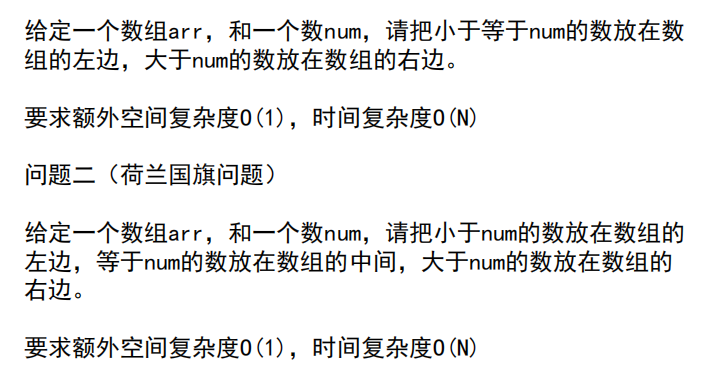
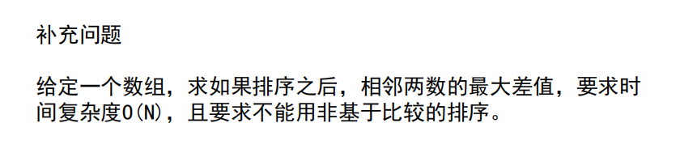
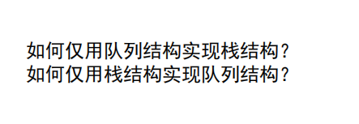
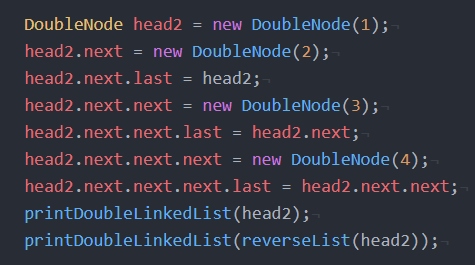
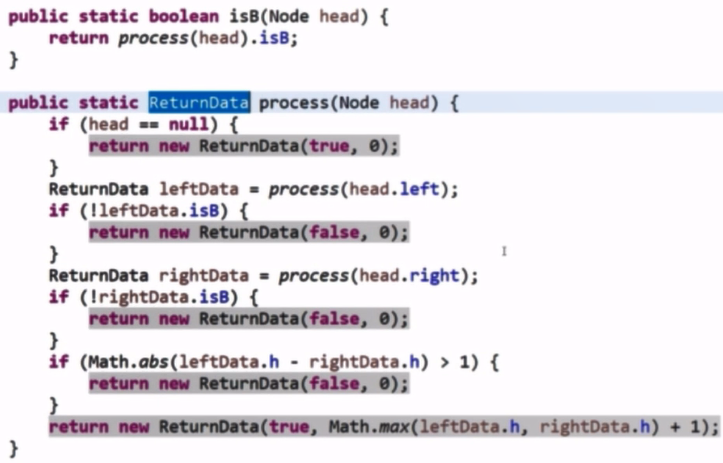
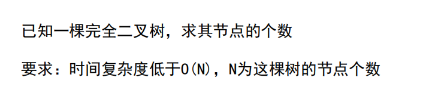

# 第一课

## 1.1 认识时间复杂度

>  时间复杂度其实就是评价算法流程的标准。

- 常数操作：处理的时间和数据量没有关系，每次都是固定时间，例如数组寻址、加减乘除、位运算等。
- 时间复杂度：常数操作数量的指标
- 评价算法的好坏：O(X)，X为时间复杂度的指标，该指标越小越好，如果指标相等，则看表达式前面指标的常数项，常数项越小越好。

## 1.2 时间复杂度计算

流程1：O(M*N)

流程2：O( M * log2 N) 或者 O (M * logN)

流程3：题目打错，应该是不在A中出现的数，排序时间复杂度设为O（M * logM）,此题外排的时间复杂度为O(N + M)，此时操作的时间复杂度为O（M * logM） + O(N + M)，因为不知道样本量哪个大那个小，因此无法化简。

## 1.3 对数器

> 0、写好还没确认对不对的方法
>
> 1、使用什么方法都可以，只要绝对正确
>
> 2、数组有数组的随机样本产生器，二叉数有二叉数的产生器，笔试前准备好产生器
>
> 3、判断0和1排完后一不一样
>
> 4、产生多个多次排序并比较

## 1.4 冒泡排序

额外空间复杂度：如需要申请额外的数组空间来作为临时数组，不用的话额外空间复杂度就是O(1),用的话如果数组空间和原来一样，则额外空间复杂度为O(N)，一半的话也是O(N)，因为忽略掉了系数，额外空间复杂度也和样本量的大小有关。

### 代码实现

> 冒泡排序的排序过程：如果是从小到大排序，如果是从第1个数开始，则第1个数与第2个比较，如果第2个数比第1个数小，则1和2交换位置，然后第2个数与第3个数比较，直到倒数第2个数与最后一个数比较。
>
> 第二轮排序还是从第1个数开始，不过只比较到倒数第3个数与倒数第2个数，以此类推，每轮少1个数。

> 时间复杂度计算：
>
> 第2个for循环里面全部是常数操作，如比较大小，赋值语句；
>
> 第1次在0~N-1上遍历N个数，
>
> 第2次在0~N-2个数上遍历N-1个数，第3次在0~N-3个数上遍历N-2个数，因此最后的结果是一个等差数列（后一项与前一项的差是一个常数），为aN^2 + bN + 1，因此时间复杂度为O (N^2)

## 1.5 选择排序

### 代码实现

> 选择排序的排序过程：如果是从小到大进行排序，从第1个位置开始查找，默认第一个位置是最小的数，最小数标识为第一个位置，然后与后面的数进行比较，如果有比最小位置的数还小的数x，则将最小数标识改为x的位置，如果有比x还小的值，则最小数标识继续改，直到最后，将最小数标识位置的值与第1个数进行交换。
>
> 第二轮则开始查找第2小的数，默认最小数标识的位置为第 2个数的位置，比较到最后，最后交换位置。

> 时间复杂度计算：第一次循环N-1次，第二次循环N-2次，知道最后循环1次，所有次数相加，通过倒序相加最后结果为n(n - 1)

## 1.6 插入排序

### 异或运算

### 代码实现

> 因为每次都是在0~x个数之间，将最后一个数插入到0~x之间合适的位置，因此叫做插入排序。
>
> 插入排序的排序过程：如果是从小到大排序，从第2个数开始，因为默认0~0位置上的数是有序的，如果第1个数比第2个数大，则交换位置，结束第一个for的第一次循环。
>
> 第二次循环开始，从第3个数开始，如果第2个数比第3个数大，则交换位置，然后第2个数再与第1个数进行比较。
>
> 第三次循环开始。从第4个数开始，如果第3个数比第4个数小，则结束第三次循环。

> 插入排序的时间复杂度与数据有关，分最好情况、最差情况和平均情况，无特定要求一般给出最差情况，冒泡排序和选择排序则不是，无论数据是什么情况，每次时间复杂度都一样。
>
> 如果是从小到大排序，一个数组是有序的，则是最好情况，时间复杂度为O (N)
>
> 如果一个数组原本是从大到小排序的，则是最坏情况，时间复杂度为O(N^2)

## 1.7 递归行为的时间复杂度的估算

例子代码：

符号上述T(N)格式的才可以用master公式求递归的复杂度

T (N) = 2 * T(N / 2)  + O (1)

a = 2, b= 2, d = 0

b为样本量被分成多少份，a为发生的次数。

## 1.8 归并排序 

### 代码实现

while (p1 <= m && p2 <= r)

## 1.9 小和问题和逆序对问题

### 小和问题

#### 代码实现

# 第二课

## 2.1 荷兰国旗问题

荷兰国旗问题代码

## 2.2 快速排序

利用荷兰旗问题改进后的快速排序代码

## 2.3 随机快速排序

避开数据导致的问题

## 2.4 堆排序

堆其实就是一个完全二叉树

大根堆是指子树的头部是这个树的最大值

小根堆是指子树的头部是这个树的最小值

## 2.5 排序算法的稳定性及其汇总

排序算法的稳定性是指排序后之前排序的顺序不变，比如全校先按成绩排，再按班级排，班级排好后里面的学生成绩已经是排好的了。

### 具有稳定性的排序算法

冒泡排序

插入排序

选择排序（不行）

归并排序

快速排序（不行）

堆排序（不行）

## 2.6 排序问题的补充

## 2.7 Java比较器的使用

Array.sort()如果对对象进行排序，如果不指定比较器，则默认是按对象的内存地址大小排序，如果比较的是基础类型，则按从小到大的顺序排序。

比较器的compare方法如果返回负数，则o1比较小，o1排在前面，如果返回正数，则o2排在前面，返回0则一样。

## 2.8 桶排序、计数排序、基数排序的介绍

## 2.9 练习

代码实现

## 2.10 工程中综合的排序算法

​	会先判断数组是基础类型还是对象

​	如果是基础类型则使用快排

​	如果是对象则使用归并

​        使用数组长度小于60，则不管数组是基础类型还是对象，则都使用插入排序

# 第三课

## 3.1 练习1：用数组实现大小固定的队列和栈 

### 3.1.1 栈

### 3.1.2 队列

## 3.2 练习2：实现特殊栈

## 3.3 练习3：用队列实现栈，用栈实现队列

### 3.3.1 用队列结构实现栈结构

### 3.3.2 用栈结构实现队列结构

## 3.4 练习4：猫狗队列

一个队列，里面包含一个Dog队列和一个Cat队列，还有一个count计数，再封装一个PetEntry类封装Pet对象和每个Pet对象对应的count

## 3.5 练习5：转圈打印矩阵

## 3.6 练习6：旋转正方形矩阵

## 3.7 练习7：封装单向和双向链表

### 3.7.1 反转单向链表

### 3.7.2 反转双向链表

## 3.8 练习8："之"字形打印矩阵

## 3.9 练习9：在行列排好序的矩阵中找数

## 3.10 练习10：打印两个有序链表的公共部分

## 3.11 练习11：判断链表是否为回文结构

### 3.11.1 需要N个额外空间

### 3.11.2 需要N/2给额外空间（但是额外空间复杂度还是O(N)）

如果链表结点数是偶数，则一半入栈，如果链表结点数是奇数，则减一，后面一半的结点数入栈。

### 3.11.3 不需要额外空间

## 3.12 练习12：

如果笔记中没有要求空间复杂度的话可以使用荷兰国旗问题

## 3.13 练习13：复制含有随机指针节点的链表

## 3.14 练习14：

首先是判断单链表是有环还是无环

如果使用HashSet，如果结点遍历到的时候还不存在于HashSet中，则放入，如果存在则存在环。

另一种方法则是不使用额外空间，通过两个指针，一个快指针和一个慢指针，快指针一次走两步，慢指针一次走一步，如果存在环，则两个指针一定会撞到一起，撞到后快指针回到头结点，变为走一步，然后两个指针一起继续走，两个指针一定会在第一个入环结点再遇到一起。

如果遇到NULL，则不存在环。

# 第四课

## 4.1 二叉树的三种遍历

先序、中序、后序遍历的递归方式

先序遍历的非递归方式

中序遍历的非递归方式

后序遍历的非递归方式1：使用两个栈

后序遍历的非递归方式2：使用一个栈

## 4.2 如何直观的打印一棵二叉树

## 4.3 在二叉树中找到一个节点的后继节点

如果一个节点有右子树，那么它的后继节点就是右子树最左的节点，如果右子树只有一个节点，那么最左的节点就是它本身。

如果一个节点没有右子树，那么它的后继节点就是往上找父节点，知道当前节点属于该父节点的左子树。

## 4.4 二叉树的序列化和反序列化

序列化：将树保存起来

反序列化：将树转成内存里的结构

## 4.5 折纸问题

## 4.6 判断一棵二叉树是否是平衡二叉树 

左右子树高度不超过1则为平衡二叉树

采用递归的方式

## 4.7 判断一棵树是否是搜索二叉树/完全二叉树

左节点都比父节点小，右节点都比父节点大的树叫搜索二叉树

## 4.8 求完全二叉树的节点树

