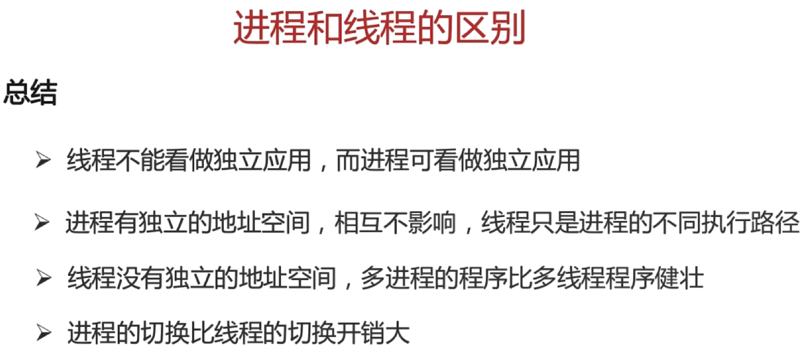
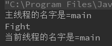
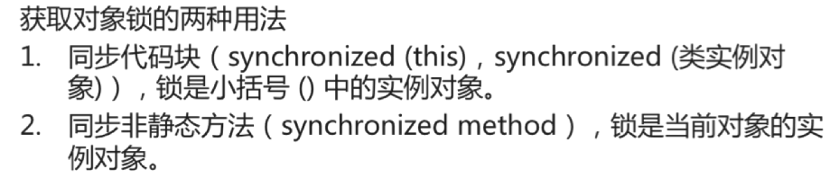
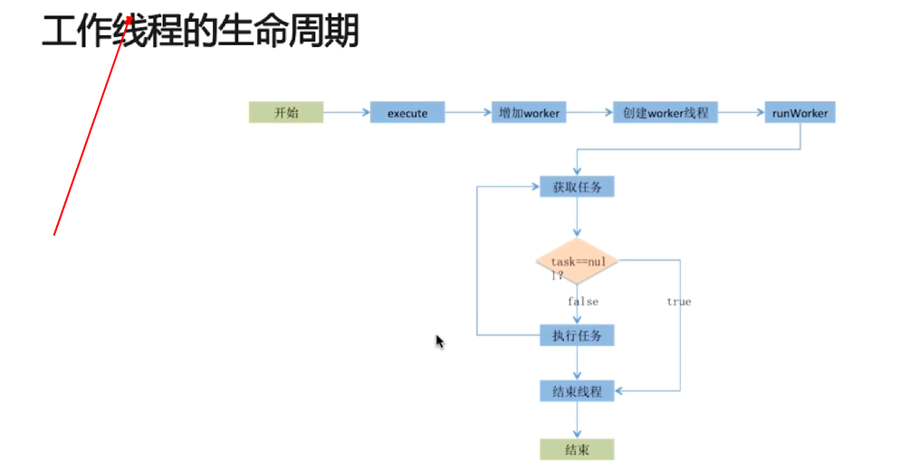
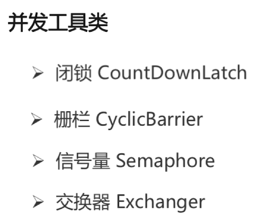
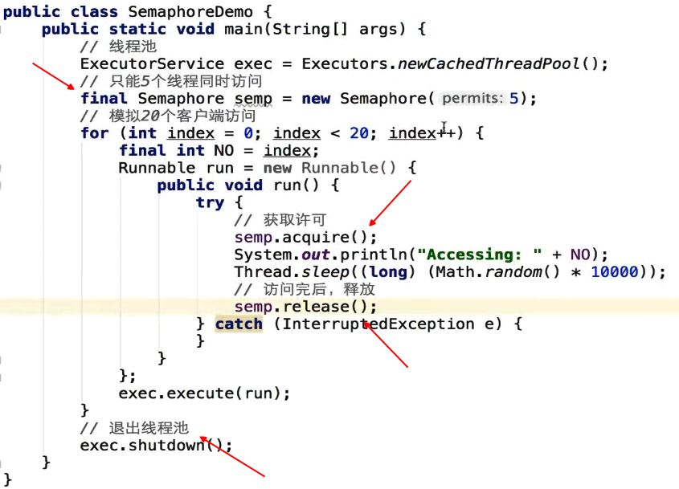
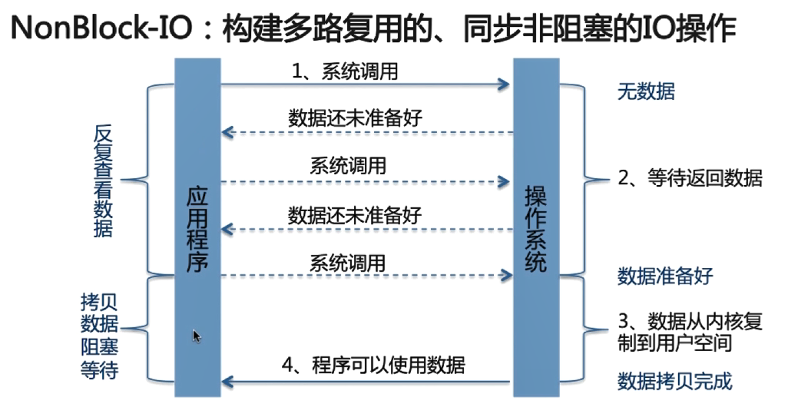
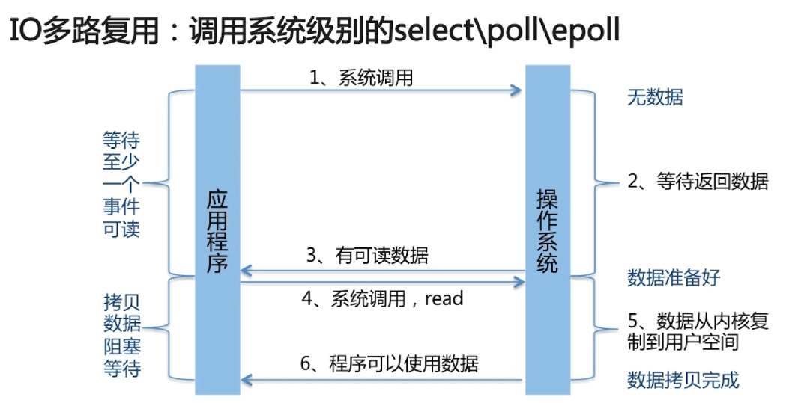
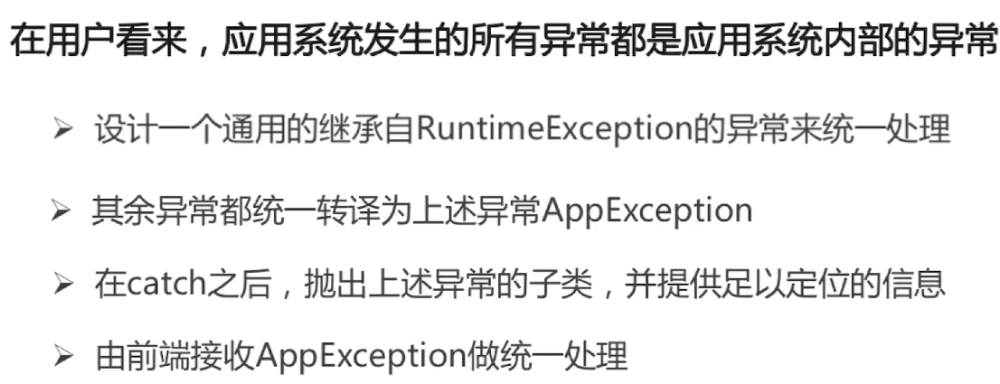

#   1. 进程和线程的区别

## 1.1 操作系统进程和线程关系

多个进程可以充分利用系统的资源，进程中有许多子任务也可以单独执行，把这些子任务弄到线程里面执行，可以更加充分的利用系统的资源。而且线程使用的内存是一样的，线程间的切换不需要更换页目录。

引入线程后，进程成为系统资源的最小单位，线程成为CPU的调度最小单位。

Java中的线程是映射到操作系统的线程上（即内核级线程），因此线程的阻塞、切换和中断都需要从用户态转换到内核态（用户态只有CPU的执行权利，访问硬盘、网络什么的只有内核态才有权限）。

GO之所以并发性能好，是因为GO的线程切换都是在用户态上进行的（用户级线程，用户级线程有个问题就是如果进程中有个线程阻塞了，则整个进程所有的线程都会阻塞，但是GO的调度器很好的解决了这个问题），并发级别是Java的好多倍。GO线程之间的通信并不是通过共享内存。

https://blog.csdn.net/chenhuaijin123/article/details/84314218

不健壮指的是一个进程中的某个线程挂了，整个进程都会挂掉

## 1.2 Java进程和线程的关系

测试Java线程是否是单线程模型

每运行一个main方法就是一个进程，如果程序内部不创建线程，那么一个Java进程内部只会有一个主线程。

需要注意的是，虽然Java程序是单线程编程模型，但是JVM实例是多线程模型，因为还有其他线程进行GC等操作。

# 2. 线程的start和run方法的区别

使用run方法运行

使用start方法运行

区别总结

start是个本地方法，会调用虚拟机里面的方法创建一个线程去执行run方法里面的内容。而run方法调用只是一个普通的方法调用。还是在当前线程里面执行。

# 3. Thread和Runnable是什么关系

Runnable是一个接口

Thread中是一个类，实现了Runnable接口，target是一个私有Runnable对象。

## 3.1 直接使用Thread

注意是继承

## 3.2 使用Runnable

注意是实现

## 3.3 区别

使用Runnable避免Java单继承带来的限制，而且如果业务类实现Runnable方法，把业务逻辑放在run方法里面，这样后期也很方便进行并发操作。

# 4. 实现处理线程的返回值

## 4.1 给run()方法传参

## 4.2 获取线程返回值

### 4.2.1 主线程等待法

缺点是需要自己实现等待的逻辑，无法精准控制等待的时间。

### 4.2.2 join()

Thread类的join()方法会阻塞当前线程以等待子线程执行完毕，join底层使用wait，wait是释放锁的 。

缺点是粒度不够细，不能很好的控制线程执行顺序。

### 4.2.3 Callable接口

#### 4.2.3.1 通过FutureTask获取

FutureTask实现了Future接口的方法。

#### 4.2.3.2 通过线程池获取

# 5. 线程的状态

注意Thread对象创建还没start之前是NEW，调用对象的getState()方法返回的是字符NEW，线程结束后资源就被回收了，因此不能重新start()

需要注意的是线程结束后不可以再调用start()方法

一个线程对象只能调用一次start方法.从new到等待运行是单行道,所以如果你对一个已经启动的线程对象再调用一次start方法的话,会产生:IllegalThreadStateException异常. 

可以被重复调用的是run()方法。

 Thread类中run()和start()方法的区别如下：

 run()方法:在本线程内调用该Runnable对象的run()方法，可以重复多次调用； 

start()方法:启动一个线程，调用该Runnable对象的run()方法，不能多次启动一个线程； 

# 6. sleep和wait的区别

两个都是本地方法

调用的是锁对象的wait方法，如果锁是加在当前对象（如synchronized方法）则需要调用this.wait()，如果是加在类对象上（如静态synchronized方法）也是调用this.wait()方法。

# 7. notify和notifyall的区别

lock.wait()进行无限期等待，另一个线程调用lock.notify()进行唤醒。 *（注意sleep()是阻塞状态，不会被唤醒）*

这两个也是本地方法。

注意是某个对象

注意是随机

# 8. yield

Thread.yield()，也是本地方法。

  

 不会让出锁。

# 9. interrupt

interrupt()方法只是通知，需要被调用的线程配合，被调用的线程调用isInterrupt（）方法进行自我检查。

# 10. synchronized

synchronized锁的不是代码，锁的都是对象。

## 10.1 获取对象锁

## 10.2 获取类锁

## 10.2 对象锁和类锁的总结

# 11. synchronized实现原理

## 11.1 对象头的结构

Mark Word会根据锁状态的不同重用Mark Word的内存。

## 11.2 重入

## 11.3 synchronized同步块实现原理

每个对象都天生自带一个monitorenter对象

编译器会自动产生一个异常处理器，这个异常处理器可以所有的异常，保证monitorenter和monitorexit可以配对执行。

## 11.4 synchronized方法实现原理

执行时会检查方法的标志，如果设置了标志，则执行线程持有这个对象的monitor，不管有没有发生异常，最终都会释放掉monitor。

## 11.5 早期的synchronized

早期的synchronized依赖于操作系统

## 11.6 Java6以后的优化(注意是优化)

### 11.6.1 自旋锁

### 11.6.2 自适应自旋锁

如果之前有线程自旋成功过，则增加自旋时间，反之减少。

### 11.6.3 锁消除

append是同步方法。

### 11.6.4 锁粗化

## 11.7 synchronized的四种状态

### 11.7.1 无锁

### 11.7.2 偏向锁

### 11.7.3 轻量级锁

### 11.7.4 重量级锁

重量级锁使用的是操作系统的互斥量

## 11.8 总结

# 12. synchronized和ReentrantLock的区别

在Java5之前，synchronized是仅有的同步手段

## 12.1 什么是ReentrantLock

## 12.2 ReentrantLock公平性

公平性可以减少线程饥饿的情况，但是Java中一般不会出现线程饥饿的情况，所以一般没有特俗需求的话，不进行公平性的设置。

因为是公平锁，所以两个线程轮流打印。

## 12.3 ReentrantLock的优势

通过lock对象新建多个condition对象，对wait、notify这些操作进行对象化。

## 12.4 区别总结

# 13. jmm内存可见性

## 13.1 什么是jmm

## 13.2 主内存和工作内存

### 13.2.1 主内存

### 13.2.2 工作内存

## 13.3 JMM和Java内存区域的区别

## 13.4 happens-before

下面这段代码（在多线程情况下）不符合happens-before

## 13.5 volatile

如果使用了syschronized可以不用volatile

### 13.5.1 volatile为什么可见

### 13.5.2 volatile如何实现可见性和禁止指令重排序

### 13.5.3 双重检测的单例模式

### 13.5.4 synchronized和volatile的区别

# 14. CAS

# 15. Java线程池

## 15.1 Executors创建的5种不同的线程池

## 15.2 Fork/Join框架

A线程从双端队列队头拿任务处理，当它自己的任务处理完后，再到其他队列的队尾拿任务。

## 15.3 Executor框架

## 15.4 ThreadPoolExecutor自定义线程池

### 15.4.1 线程池执行过程

### 15.4.2 构造方法

## 15.5 线程池5种状态

## 15.6 线程池大小如何选定（建议而已）

# 16. JUC包梳理

## 16.1 并发工具类 

### 16.1.1 闭锁CountDownLatch

### 16.1.2 栅栏CyclicBarrieer

和CountDownLatch的区别是，所有子线程到达栅栏处都得停止直到count变为0后才能继续执行。

### 16.1.3 信号量

### 16.1.4 交换器Exchanger

**只能**用于两个线程交换数据，如果A线程到达同步点，B线程还没到同步点，则A线程会阻塞在这里

## 16.2 并发集合

并发集合重要的除了ConcurrentHashMap，另一个重要的就是BlockingQueue

7个实现类，都是线程安全的

# 17. 题外：JavaIO机制

## 17.1 BIO、NIO、AIO

### 17.1.1 BIO

优点是实现简单，缺点是会阻塞（阻塞的线程会挂起）

### 17.1.2 NIO

反复查看数据的阶段是非阻塞的，拷贝数据是阻塞的。

Channel > Buffer：将Channel中的数据读到Buffer中

Channel < Buffer:   将Buffer中的数据写入到Channel中

Selector允许单个线程处理多个Channel

### 17.1.3 AIO  （NIP2.0）

异步非阻塞

### 17.1.4 BIO、NIO、AIO的区别

BIO适用于连接数小且固定的架构，这种对服务器资源的要求比较高。

NIO适用于连接数多且时间短的架构，AIO则相反。

## 17.2 操作系统IO多路复用

select、poll、epoll是操作系统底层的。

select是有极限的，因为它的底层是数组。

 

# 18. Java异常

## 18.1 Java异常体系

 

Throwable的父类是Object

Error是JVM无法处理的异常，一旦出现该异常，程序就会退出，如内存溢出异常，栈溢出异常。

RuntimeException是编译器无法检查出，但是程序可以处理的异常，如数组下标越界异常。

非RuntimeException是编译器检查到的异常，必须处理，如IO中文件找不到的异常。

 

## 18.2  Error和Excepiton的区别

## 18.3 常见的Error以及Exception

当JVM在加载一个类的时候，如果这个类在编译时是可用的，但是在运行时找不到这个类的定义的时候，JVM就会抛出一个NoClassDefFoundError错误。比如当我们在new一个类的实例的时候，如果在运行是类找不到，则会抛出一个NoClassDefFoundError的错误。 

先创建一个TempClass，然后编译以后，将TempClass生产的TempClass.class文件删除 

### 18.3.1 ClassNotFoundException和NoClassDefFoundError的区别

| **ClassNotFoundException**                                   | **NoClassDefFoundError**                          |
| ------------------------------------------------------------ | ------------------------------------------------- |
| 从java.lang.Exception继承，是一个Exception类型（检查异常）   | 从java.lang.Error继承，是一个Error类型            |
| 当动态加载Class的时候找不到类会抛出该异常                    | 当编译成功以后执行过程中Class找不到导致抛出该错误 |
| 一般在执行Class.forName()、ClassLoader.loadClass()或ClassLoader.findSystemClass()的时候抛出 | 由JVM的运行时系统抛出                             |

## 18.4 Java如何处理异常

### 18.4.1 处理异常的原则

尽量使用if来处理可能发生异常的结果，使用try-catch会影响性能。

# 19. Java集合

集合中还有Map，就不在这里讲述了。